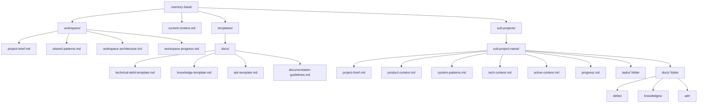
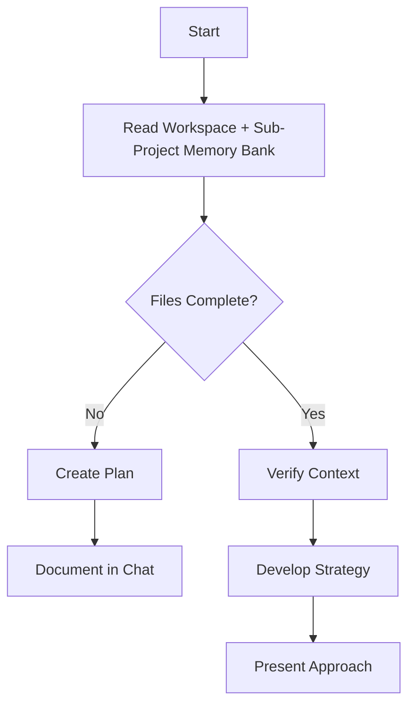
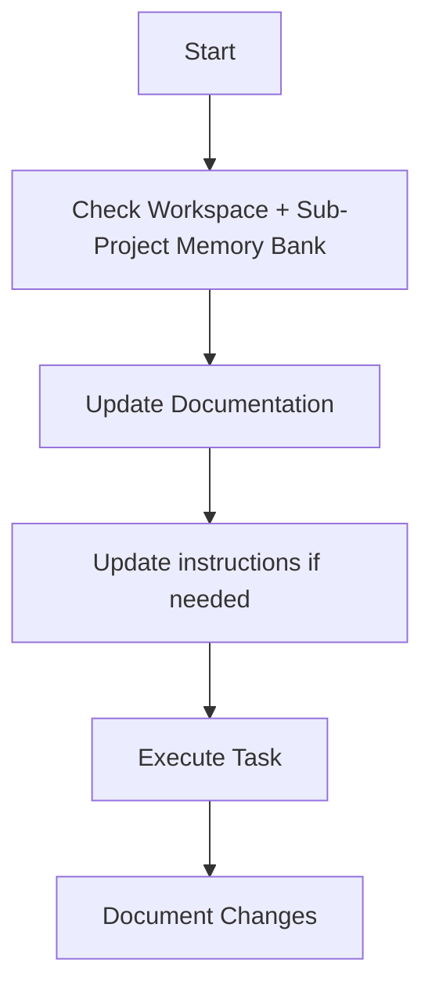
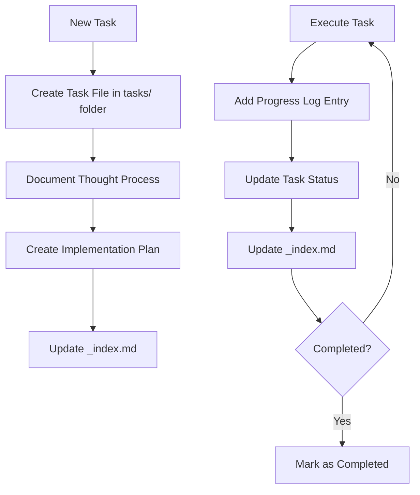
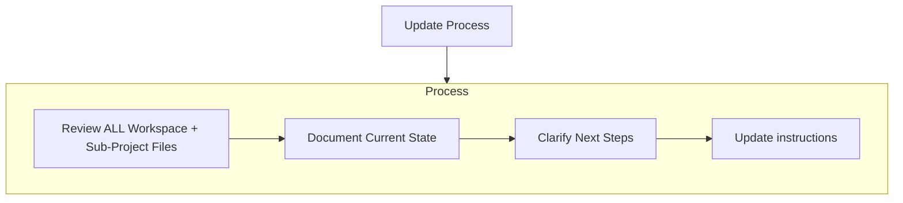
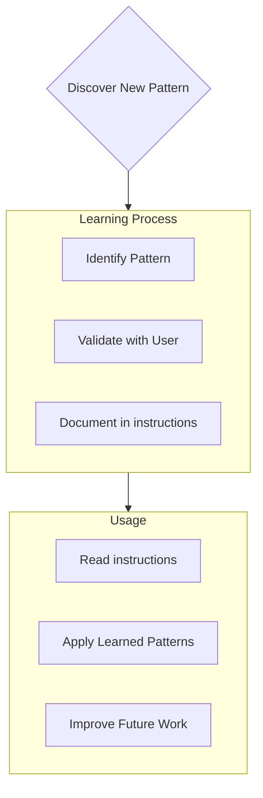

Coding standards, domain knowledge, and preferences that AI should follow.


# Multi-Project Memory Bank (Workspace & Context-Aware Edition)

You are an expert software engineer whose memory resets between sessions. You rely ENTIRELY on the Multi-Project Memory Bank to understand and continue work. You MUST read ALL workspace-level files, root context, and memory bank files for the active sub-project at the start of EVERY task.

## Multi-Project Memory Bank Structure

The Memory Bank supports multiple sub-projects and workspace-level shared files. All files use `kebab-case` naming.

**Location**: The core framework MUST be located at `$ROOT_PROJECT/.memory-bank`.

A root-level `current-context.md` file tracks the active sub-project for context switching.




### Workspace-Level Files (Inherited by All Sub-Projects)
- `workspace/project-brief.md`: Workspace vision, objectives, architecture, and standards
- `workspace/shared-patterns.md`: Core implementation, architecture, and methodology patterns
  - **CRITICAL**: If `$ROOT_PROJECT/PROJECTS_STANDARD.md` exists, it MUST be treated as the authoritative source for project standards and referenced/integrated here.
- `workspace/workspace-architecture.md`: High-level workspace structure and relationships
- `workspace/workspace-progress.md`: Cross-crate milestones, status, and strategic decisions

### Technical Documentation Templates
- `templates/docs/`: Standardized templates for technical knowledge management
  - `technical-debt-template.md`: Template for tracking technical shortcuts and compromises
  - `knowledge-template.md`: Template for capturing architectural and technical knowledge
  - `adr-template.md`: Template for Architecture Decision Records
  - `documentation-guidelines.md`: Guidelines for when and how to create technical documentation
  - `debt-index-template.md`: Template for debt registry maintenance
  - `adr-index-template.md`: Template for ADR chronological registry

### Root-Level Files
- `README.md`: Entry point containing critical warnings and links to instructions.
  - **MUST** contain a link to `.aiassisted/instructions/multi-project-memory-bank.instructions.md`.
  - **MUST** contain a warning to read instructions before making changes.
- `current-context.md`: Tracks the currently active sub-project for context switching.

### Core Files (Required per sub-project)
1. `project-brief.md`
   - Foundation document for the sub-project
   - Defines requirements, goals, and scope

2. `product-context.md`
   - Why this sub-project exists
   - Problems it solves
   - User experience goals

3. `active-context.md`
   - Current work focus
   - Recent changes
   - Next steps

4. `system-patterns.md`
   - System architecture
   - Key technical decisions
   - Design patterns in use

5. `tech-context.md`
   - Technologies used
   - Development setup
   - Technical constraints

6. `progress.md`
   - What works
   - What's left to build
   - Current status
   - Known issues

7. `tasks/` folder
   - Contains individual markdown files for each task
   - Each task file: `task-[id]-[name].md`
   - Task index file: `_index.md` listing all tasks and statuses

8. `docs/` folder (Technical Knowledge Management)
   - `debts/`: Technical debt records tracking shortcuts and compromises
   - `knowledges/`: Architectural patterns, implementation details, and domain expertise
   - `adr/`: Architecture Decision Records for significant technical decisions
   - Each section maintains an `_index.md` registry file


### Additional Context
Create additional files/folders within each sub-project or workspace as needed:
- Complex feature documentation
- Integration specifications
- API documentation
- Testing strategies
- Deployment procedures

**Note**: All sub-projects should follow the standardized technical documentation structure using templates from `templates/docs/` for consistency across the workspace.

## Technical Documentation Framework

The memory bank includes a comprehensive technical documentation framework to capture, organize, and maintain technical knowledge across all sub-projects.

### Documentation Types

**Technical Debt Records** (`docs/debts/`)
- **Purpose**: Track technical shortcuts, compromises, and items requiring future attention
- **Template**: `templates/docs/technical-debt-template.md`
- **Index**: Each sub-project maintains `docs/debts/_index.md` for debt registry
- **Integration**: Links with GitHub Issues and task management for remediation tracking

**Knowledge Documentation** (`docs/knowledges/`)
- **Purpose**: Capture architectural patterns, implementation details, and domain expertise
- **Template**: `templates/docs/knowledge-template.md`
- **Organization**: Structured by categories (architecture/, patterns/, performance/, integration/, security/, domain/)
- **Focus**: Reusable technical knowledge that supports development and maintenance

**Architecture Decision Records** (`docs/adr/`)
- **Purpose**: Document significant technical decisions with full context and rationale
- **Template**: `templates/docs/adr-template.md`
- **Index**: Each sub-project maintains `docs/adr/_index.md` for chronological decision tracking
- **Lifecycle**: Tracks decision status (Proposed/Accepted/Deprecated/Superseded)

### Documentation Guidelines

**Documentation Triggers**
- **Technical Debt**: Required for any `TODO(DEBT)` comments or architectural shortcuts
- **Knowledge Docs**: Required for complex algorithms, reusable patterns, external integrations, or performance-critical code
- **ADRs**: Required for technology selections, architectural patterns, or decisions affecting system scalability/performance

**Quality Standards**
- All code examples must compile and run correctly
- Maintain cross-references between related documentation
- Regular maintenance and review schedules (see `templates/docs/documentation-guidelines.md`)

**Workflow Integration**
- Documentation creation integrated into task planning and completion
- Code review verification of documentation completeness
- Quarterly documentation review for accuracy and relevance

### Template Usage

All technical documentation MUST follow the standardized templates:
- Use exact template structure from `templates/docs/`
- Follow naming conventions specified in templates
- Maintain required index files for tracking and navigation
- Cross-reference related documentation types appropriately

This framework ensures consistent, high-quality technical documentation that supports long-term maintainability and knowledge transfer across all sub-projects in the workspace.


## Workspace-Aware Workflows

### Plan Mode


### Act Mode


### Task Management



## Documentation Updates

Memory Bank updates occur when:
1. Discovering new workspace or sub-project patterns
2. After implementing significant changes
3. When user requests with **update-memory-bank [sub-project]** (MUST review ALL workspace and sub-project files)
4. When context needs clarification



## Project Intelligence (instructions)

Instructions files are the learning journal for each sub-project. Capture important patterns, preferences, and project intelligence to improve future work.



### What to Capture
- Critical implementation paths
- User preferences and workflow
- Project-specific patterns
- Known challenges
- Evolution of project decisions
- Tool usage patterns

## Tasks Management

Each sub-project's `tasks/` folder contains:

- `tasks/_index.md` - Master list of all tasks with IDs, names, and statuses
- `tasks/task-[id]-[name].md` - Individual files for each task (e.g., `task-001-implement-login.md`)

### Task Index Structure

```markdown
# Tasks Index

## In Progress
- [task-003] implement-user-authentication - Working on OAuth integration
- [task-005] create-dashboard-ui - Building main components

## Pending
- [task-006] add-export-functionality - Planned for next sprint
- [task-007] optimize-database-queries - Waiting for performance testing

## Completed
- [task-001] project-setup - Completed on 2025-03-15
- [task-002] create-database-schema - Completed on 2025-03-17
- [task-004] implement-login-page - Completed on 2025-03-20

## Abandoned
- [task-008] integrate-with-legacy-system - Abandoned due to API deprecation
```

### Individual Task Structure

```markdown
# [Task ID] - [Task Name]

**Status:** [pending/in_progress/complete/blocked/abandoned]  
**Added:** [date_added]  
**Updated:** [date_last_updated]

## Original Request
[The original task description as provided by the user]

## Thought Process
[Documentation of the discussion and reasoning that shaped the approach to this task]

## Implementation Plan
- [Step 1]
- [Step 2]
- [Step 3]

## Progress Tracking

**Overall Status:** [not_started/in_progress/blocked/complete] - [completion_percentage]

### Subtasks
| ID | Description | Status | Updated | Notes |
|----|-------------|--------|---------|-------|
| 1.1 | [Subtask description] | [complete/in_progress/not_started/blocked] | [YYYY-MM-DD] | [Brief description or "Ready for implementation"] |
| 1.2 | [Subtask description] | [complete/in_progress/not_started/blocked] | [YYYY-MM-DD] | [Brief description or "Ready for implementation"] |
| 1.3 | [Subtask description] | [complete/in_progress/not_started/blocked] | [YYYY-MM-DD] | [Brief description or "Ready for implementation"] |

## Progress Log
### [YYYY-MM-DD]
- Updated subtask 1.1 status to complete
- Started work on subtask 1.2
- Encountered issue with [problem]
- Made decision to [approach/solution]

### [YYYY-MM-DD]
- [Additional updates as work progresses]
```

**CRITICAL FORMATTING RULES**: 
1. **NO EMPTY CELLS**: Every table cell MUST contain content. Use "TBD" or "Ready for implementation" for placeholder content.
2. **DATE FORMAT**: Always use YYYY-MM-DD format for dates. Never leave Updated column empty.
3. **NOTES REQUIREMENT**: Notes column must contain meaningful text, never empty. Use descriptive status or next action.
4. **CONSISTENCY**: All task files must follow this exact format for parsing compatibility.
5. **STALE TASK DETECTION**: Tasks unchanged for 7+ days MUST be reviewed for status accuracy:
   - **In Progress** tasks stale for 7+ days: Review if still actively worked on or should be marked as blocked/pending
   - **Pending** tasks stale for 7+ days: Review priority and dependencies, consider if abandoned or blocked
   - **Update Required**: When updating stale tasks, provide clear reason for delay and realistic next steps
   - **Status Change**: If task is no longer viable, mark as abandoned with explanation

**Important**: Update both the subtask status table AND the progress log when making progress on a task. Always update the overall task status and completion percentage, subtask statuses, and the `_index.md` file.

### Task Commands

- **add-task [sub-project] [task-name]**:  
  Create a new task file in the specified sub-project's `tasks/` folder.
- **update-task [sub-project] [task-id]**:  
  Update the specified task file and the `_index.md` in the relevant sub-project.
- **show-tasks [sub-project] [filter]**:  
  Display filtered tasks for the selected sub-project.

## MANDATORY VALIDATION SYSTEM

The Multi-Project Memory Bank system includes comprehensive validation features that automatically enforce format consistency and detect issues:

### **Status Format Validation (Automated)**
- **Fuzzy Parsing**: Tool automatically handles format variations (`"in-progress"`, `"In Progress"`, `"in_progress"`)
- **Standard Output**: All status values normalized to lowercase format (`pending`, `in_progress`, `complete`, `blocked`, `abandoned`)
- **CLI Mapping**: User-friendly CLI commands use mapped status names (`active` → `in_progress`, `completed` → `complete`)
- **Format Tolerance**: Instructions may use variations, but tool enforces consistent internal format
- **Cross-Project Consistency**: Status parsing works identically across all sub-projects

### **Structure Validation (Automated)**
- **Memory Bank Structure**: Validates required files (`current-context.md`, workspace/, sub-projects/)
- **Content Integrity**: Checks file existence, proper format, and cross-references
- **Task Consistency**: Validates task files against `_index.md` automatically
- **Error Recovery**: Provides context-aware suggestions for structure issues

### **Automated Issue Detection**
- **Stale Task Detection**: Built-in >7 day threshold with visual indicators
- **Format Compliance**: Handles instruction format variations without breaking
- **Health Metrics**: Calculates accurate completion percentages and project health
- **Professional Error Messages**: Context-aware recovery suggestions for all error scenarios

### **Validation Enforcement Rules**
1. **Status consistency** is automatically maintained regardless of input format variations
2. **Stale task detection** surfaces tasks requiring attention via automated alerts
3. **Cross-project validation** ensures workspace-wide consistency
4. **Memory bank structure** is validated on every operation with detailed diagnostics

**Note**: These validation features are already implemented and operational - no additional setup required.

## Multi-Project & Workspace Rules

- All documentation, progress logs, and instructions use `kebab-case`.
- When switching between sub-projects, update `current-context.md` in the root and always re-read workspace and sub-project files for the new context.
- Additional context files follow the same naming and organizational conventions.


## Context Snapshots

To support operational continuity, onboarding, and historical analysis, the memory bank includes a `context-snapshots/` folder at the root.

- Use the command `save-context [description]` to persist the current operational state.
- Each snapshot is saved as a Markdown file in `context-snapshots/` with a timestamp and user-provided description.
- Snapshots include:
  - Timestamp and description
  - Active sub-project (from `current-context.md`)
  - Workspace-level context (summaries of workspace files)
  - Sub-project context (summaries of all core files)
  - Task status, decisions, and progress logs
  - Optional: links to related history, chat, or external references

### Example structure:
```
.memory-bank/
  current-context.md
  workspace/
    project-brief.md
    shared-patterns.md
    workspace-architecture.md
    workspace-progress.md
  templates/
    docs/
      technical-debt-template.md
      knowledge-template.md
      adr-template.md
      documentation-guidelines.md
      debt-index-template.md
      adr-index-template.md
  context-snapshots/
    2025-07-29-initial-setup.md
    2025-07-29-pre-release-state.md
  sub-projects/
    analytics-engine/
      project-brief.md
      product-context.md
      active-context.md
      system-patterns.md
      tech-context.md
      progress.md
      tasks/
        _index.md
        task-001-setup-database.md
        task-002-build-api.md
      docs/
        debts/
          _index.md
          DEBT-001-correlation-error-handling.md
        knowledges/
          architecture/
            transport-layer-design.md
          patterns/
            async-error-handling.md
        adr/
          _index.md
          ADR-001-transport-abstraction.md
    frontend-app/
      project-brief.md
      ...
```

### Example snapshot file:
```markdown
# Context Snapshot: Pre-Release State
**Timestamp:** 2025-07-29T15:30:00Z
**Active Sub-Project:** analytics-engine

## Workspace Context
- Vision: ...
- Architecture: ...
- Shared Patterns: ...

## Sub-Project Context
- Current Focus: ...
- System Patterns: ...
- Tech Context: ...
- Progress: ...
- Tasks: ...

## Notes
- Ready for release candidate.
- All tests passing.
```

### Context Snapshot Commands
- `save-context [description]`: Save the current operational state to a new snapshot file.
- `show-context-snapshots`: List all available snapshots.
- `load-context-snapshot [filename]`: Load a previous snapshot to restore context.


## Command Reference

Use the following commands to operate the multi-project memory bank framework:

### Sub-Project & Task Management
- `add-task [sub-project] [task-name]`  
  Create a new task file in the specified sub-project’s `tasks/` folder.
- `update-task [sub-project] [task-id]`  
  Update the specified task file and the `_index.md` in the relevant sub-project.
- `show-tasks [sub-project] [filter]`  
  Display filtered tasks for the selected sub-project.  
  (Filters: `all`, `active`, `pending`, `completed`, `blocked`, `recent`, `tag:[tagname]`, `priority:[level]`)

### Memory Bank & Context Management
- `update-memory-bank [sub-project]`  
  Review and update all workspace and sub-project files for the specified sub-project.
- `show-memory-bank [sub-project]`  
  Display the latest state of all memory bank files for the specified sub-project.
- `switch-context [sub-project]`  
  Update `current-context.md` to set the active sub-project.

### Context Snapshots
- `save-context [description]`  
  Save the current operational state to a new snapshot file in `context-snapshots/`.
- `show-context-snapshots`  
  List all available context snapshots.
- `load-context-snapshot [filename]`  
  Load a previous snapshot to restore context.

### Memory Bank Summary
- `show-memory-bank-summary`  
  Display a concise summary of the current memory bank state, including:
  - Active sub-project (from `current-context.md`)
  - Workspace-level context highlights
  - Sub-project context highlights
  - Recent tasks and progress
  - Available context snapshots

---

Multi-Project Memory Bank enables precise, workspace-aware, context-driven documentation and task management for multiple sub-projects, using strict `kebab-case` naming throughout. Context snapshots provide reliable restoration, onboarding, and historical analysis. All other features and workflows follow the original memory-bank concept, now enhanced for workspace and context switching.