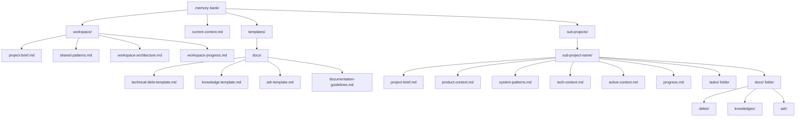
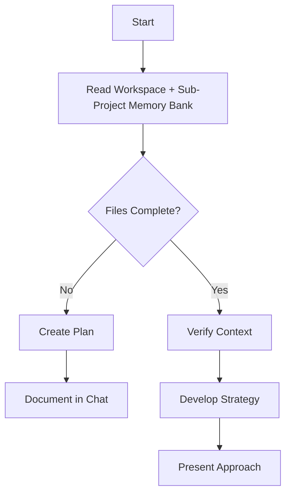
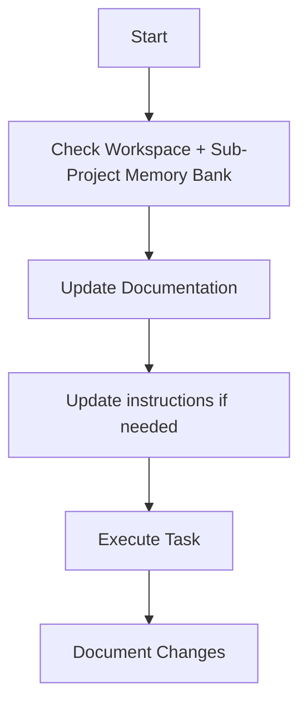
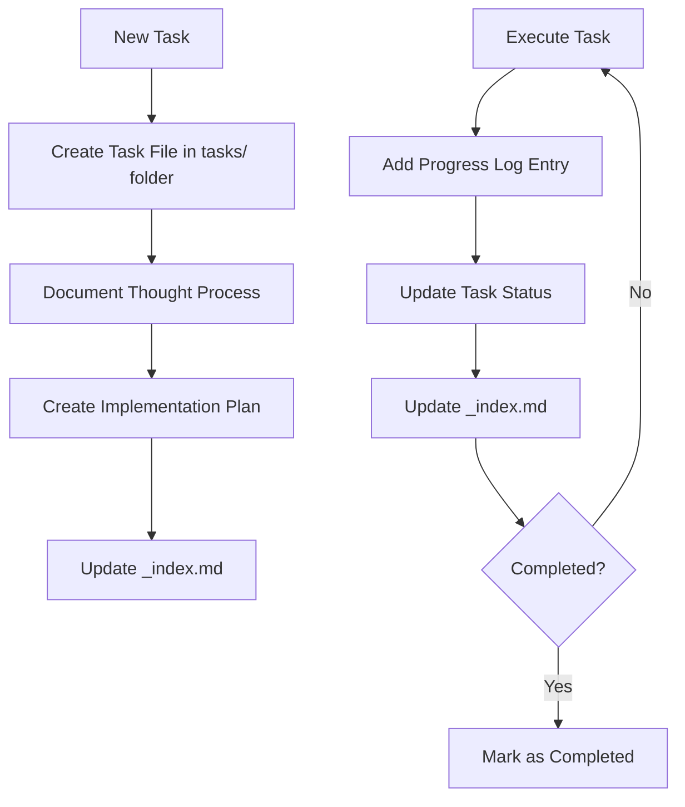
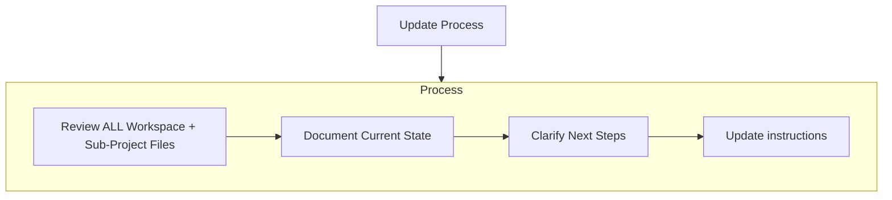
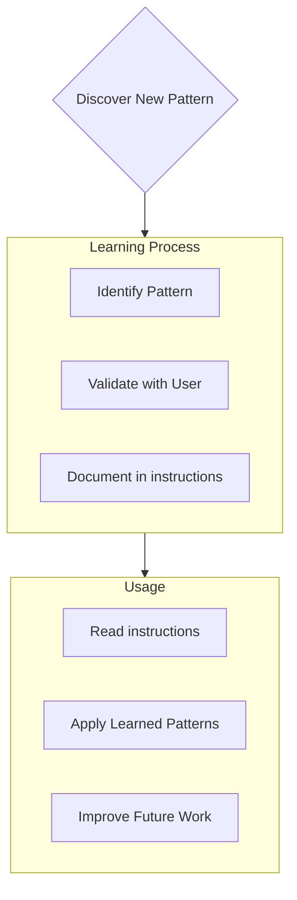

Coding standards, domain knowledge, and preferences that AI should follow.


# Multi-Project Memory Bank (Workspace & Context-Aware Edition)

You are an expert software engineer whose memory resets between sessions. You rely ENTIRELY on the Multi-Project Memory Bank to understand and continue work. You MUST read ALL workspace-level files, root context, and memory bank files for the active sub-project at the start of EVERY task.

## Multi-Project Memory Bank Structure

The Memory Bank supports multiple sub-projects and workspace-level shared files. All files use `kebab-case` naming.

**Location**: The core framework MUST be located at `$ROOT_PROJECT/.memory-bank`.

A root-level `current-context.md` file tracks the active sub-project for context switching.




### Workspace-Level Files (Inherited by All Sub-Projects)
- `workspace/project-brief.md`: Workspace vision, objectives, architecture, and standards
- `workspace/shared-patterns.md`: Core implementation, architecture, and methodology patterns
  - **CRITICAL**: If `$ROOT_PROJECT/PROJECTS_STANDARD.md` exists, it MUST be treated as the authoritative source for project standards and referenced/integrated here.
- `workspace/workspace-architecture.md`: High-level workspace structure and relationships
- `workspace/workspace-progress.md`: Cross-crate milestones, status, and strategic decisions

### Technical Documentation Templates
- `templates/docs/`: Standardized templates for technical knowledge management
  - `technical-debt-template.md`: Template for tracking technical shortcuts and compromises
  - `knowledge-template.md`: Template for capturing architectural and technical knowledge
  - `adr-template.md`: Template for Architecture Decision Records
  - `documentation-guidelines.md`: Guidelines for when and how to create technical documentation
  - `debt-index-template.md`: Template for debt registry maintenance
  - `adr-index-template.md`: Template for ADR chronological registry

### Root-Level Files
- `README.md`: Entry point containing critical warnings and links to instructions.
  - **MUST** contain a link to `.aiassisted/instructions/multi-project-memory-bank.instructions.md`.
  - **MUST** contain a warning to read instructions before making changes.
- `current-context.md`: Tracks the currently active sub-project for context switching.

### Core Files (Required per sub-project)
1. `project-brief.md`
   - Foundation document for the sub-project
   - Defines requirements, goals, and scope

2. `product-context.md`
   - Why this sub-project exists
   - Problems it solves
   - User experience goals

3. `active-context.md`
   - Current work focus
   - Recent changes
   - Next steps

4. `system-patterns.md`
   - System architecture
   - Key technical decisions
   - Design patterns in use

5. `tech-context.md`
   - Technologies used
   - Development setup
   - Technical constraints

6. `progress.md`
   - What works
   - What's left to build
   - Current status
   - Known issues

7. `tasks/` folder
   - Contains individual markdown files for each task
   - Each task file: `task-[id]-[name].md`
   - Task index file: `_index.md` listing all tasks and statuses

8. `docs/` folder (Technical Knowledge Management)
   - `debts/`: Technical debt records tracking shortcuts and compromises
   - `knowledges/`: Architectural patterns, implementation details, and domain expertise
   - `adr/`: Architecture Decision Records for significant technical decisions
   - Each section maintains an `_index.md` registry file


### Additional Context
Create additional files/folders within each sub-project or workspace as needed:
- Complex feature documentation
- Integration specifications
- API documentation
- Testing strategies
- Deployment procedures

**Note**: All sub-projects should follow the standardized technical documentation structure using templates from `templates/docs/` for consistency across the workspace.

## Technical Documentation Framework

The memory bank includes a comprehensive technical documentation framework to capture, organize, and maintain technical knowledge across all sub-projects.

### Documentation Types

**Technical Debt Records** (`docs/debts/`)
- **Purpose**: Track technical shortcuts, compromises, and items requiring future attention
- **Template**: `templates/docs/technical-debt-template.md`
- **Index**: Each sub-project maintains `docs/debts/_index.md` for debt registry
- **Integration**: Links with GitHub Issues and task management for remediation tracking

**Knowledge Documentation** (`docs/knowledges/`)
- **Purpose**: Capture architectural patterns, implementation details, and domain expertise
- **Template**: `templates/docs/knowledge-template.md`
- **Organization**: Structured by categories (architecture/, patterns/, performance/, integration/, security/, domain/)
- **Focus**: Reusable technical knowledge that supports development and maintenance

**Architecture Decision Records** (`docs/adr/`)
- **Purpose**: Document significant technical decisions with full context and rationale
- **Template**: `templates/docs/adr-template.md`
- **Index**: Each sub-project maintains `docs/adr/_index.md` for chronological decision tracking
- **Lifecycle**: Tracks decision status (Proposed/Accepted/Deprecated/Superseded)

### Documentation Triggers (MANDATORY)

**Technical Debt MUST be documented for:**
- Any `TODO(DEBT)` comments in code
- Any architectural shortcuts or compromises
- Any known limitations or incomplete features
- Any deferred functionality with intended resolution

**Knowledge Docs MUST be created for:**
- Any new architectural pattern or boundary (module, subsystem)
- Any non-obvious algorithm choice with justification
- Any external system integration with interaction patterns
- Any performance optimization with trade-off analysis
- Any security-critical code paths
- Any concurrent/async complexity with flow explanation

**Examples of when to create:**
- ✅ Implementing new actor communication pattern → Create knowledge doc
- ✅ Choosing between two async strategies → Create ADR + knowledge doc
- ✅ Integrating with WASM runtime → Create knowledge doc + ADR
- ❌ Adding a simple utility function → No doc required
- ❌ Updating error message → No doc required

**ADRs MUST be created for:**
- Technology selection decisions with rationale
- Architectural pattern choices and justification
- Decisions affecting scalability, security, or performance
- Decisions with significant trade-off implications
- Changes to core system design patterns

### Quality Standards

- All code examples must compile and run correctly
- Maintain cross-references between related documentation
- Regular maintenance and review schedules (see `templates/docs/documentation-guidelines.md`)

### Workflow Integration

- Documentation creation integrated into task planning and completion
- Code review verification of documentation completeness
- Quarterly documentation review for accuracy and relevance

### Template Usage

All technical documentation MUST follow the standardized templates:
- Use exact template structure from `templates/docs/`
- Follow naming conventions specified in templates
- Maintain required index files for tracking and navigation
- Cross-reference related documentation types appropriately

This framework ensures consistent, high-quality technical documentation that supports long-term maintainability and knowledge transfer across all sub-projects in the workspace.

---

## Test Quality Standards (MANDATORY)

### Comprehensive Testing Requirement

All implementations MUST include BOTH unit tests AND integration tests. This is a non-negotiable requirement for any code to be considered complete.

### What Counts as "Complete Testing"

**UNIT TESTS (in src/ modules with #[cfg(test)])**
- Test individual functions/structures
- Test success paths, error cases, and edge cases
- Located in the same file as implementation
- Verify code compiles and functions work as designed
- Run with: `cargo test --lib`

**INTEGRATION TESTS (in tests/ directory)**
- Test real end-to-end workflows
- Test interaction between components/modules
- Test actual message/data flow
- Verify feature works from user perspective
- Demonstrate the feature actually accomplishes its goal
- File naming: `tests/[module-name]-integration-tests.rs`
- Run with: `cargo test --test [module-name]-integration-tests`

### What Does NOT Count as "Complete Testing"

❌ Tests that only validate configuration/metrics/helper APIs  
❌ Tests that don't instantiate real components  
❌ Tests that don't prove the feature works  
❌ Missing unit tests OR missing integration tests (BOTH required)  
❌ Tests that are failing  
❌ Any code with compiler or clippy warnings  

### Test Fixture Verification Requirement

Test fixtures MUST exist BEFORE writing integration tests:
- Identify all fixtures needed by tests before implementation
- Verify fixture files exist in `tests/fixtures/`
- If fixture missing: Create blocker task to build fixture first
- Implement feature and tests ONLY after fixtures are ready
- Do NOT write stub tests as a workaround for missing fixtures

---

## Fixture Management for Testing

### Fixture Inventory Requirement

Every sub-project's `tests/` folder MUST maintain a `fixtures/` directory with:
- All test fixtures required by integration tests
- A `README.md` listing what each fixture is and why it exists
- Fixture creation/update documentation
- All fixtures under version control (not generated at test time)

### Fixture Verification in Planning

When planning tasks with integration tests:
1. Identify all fixtures required by planned tests
2. Check if fixture files exist in `tests/fixtures/`
3. If fixture missing: Add blocker task to create it
4. Mark plan as "BLOCKED" if critical fixtures missing
5. Document all fixture dependencies explicitly in task file

### Fixture Verification in Implementation

Before writing integration tests:
1. Verify all required fixtures exist and are loadable
2. Test that fixtures load/work correctly in your code
3. If fixture issue found: Fix fixture first, THEN write tests
4. Document fixture usage in test comments (what fixture is used and why)
5. Never skip fixture verification by writing stub tests

### Example: WASM Fixture Verification

```bash
# Before writing WASM integration tests:

# 1. Check fixture exists
if [ ! -f "tests/fixtures/basic-handle-message.wasm" ]; then
    echo "ERROR: Required fixture missing"
    exit 1
fi

# 2. Verify fixture is valid WASM
file tests/fixtures/basic-handle-message.wasm
# Should show: WebAssembly (wasm) binary module

# 3. Load fixture in test setup
let component = Component::from_file("tests/fixtures/basic-handle-message.wasm")?;
// Only proceed with test if fixture loads successfully
```

---

## Workspace-Aware Workflows

### Plan Mode


### Act Mode


### Task Management



## Documentation Updates

Memory Bank updates occur when:
1. Discovering new workspace or sub-project patterns
2. After implementing significant changes
3. When user requests with **update-memory-bank [sub-project]** (MUST review ALL workspace and sub-project files)
4. When context needs clarification



## Project Intelligence (instructions)

Instructions files are the learning journal for each sub-project. Capture important patterns, preferences, and project intelligence to improve future work.



### What to Capture
- Critical implementation paths
- User preferences and workflow
- Project-specific patterns
- Known challenges
- Evolution of project decisions
- Tool usage patterns

## Tasks Management

### Task Taxonomy & Hierarchy

**CRITICAL**: All tasks MUST follow a standardized taxonomy to ensure consistency across all sub-projects.

#### Hierarchy Levels

```
TASK (Top Level)
  └─ PHASE (Optional: For tasks >4 weeks)
      └─ SUBTASK (Mandatory: Granular work units)
```

#### Level Definitions

| Level | ID Format | Example | Duration | When to Use | Max Count |
|-------|-----------|---------|----------|-------------|-----------|
| **Task** | `[PREFIX]-TASK-###` | `WASM-TASK-004` | 1-12 weeks | Top-level work item | N/A |
| **Phase** | `Phase N` | `Phase 1`, `Phase 2` | 1-4 weeks | Major milestone within task (>4 weeks total) | 8 per task |
| **Subtask** | `N.M` | `1.1`, `1.2`, `3.5` | <1 week | Granular work unit | 10 per phase |

#### Hierarchy Rules

1. **Task**: Always required. One file = one task.
2. **Phase**: Optional. Use ONLY if total task duration >4 weeks. Maximum 8 phases per task.
3. **Subtask**: Always required. Each phase (or task if no phases) MUST have subtasks. Maximum 10 subtasks per phase.
4. **No Deeper Nesting**: Subtasks CANNOT have sub-subtasks. Use checklists within subtasks if needed.
5. **Numbering**:
   - Phases: Sequential integers (`Phase 1`, `Phase 2`, `Phase 3`, ...)
   - Subtasks: `Phase.Subtask` format (`1.1`, `1.2`, `2.1`, `2.2`, ...)
   - If no phases: Use `1.1, 1.2, 1.3, ...` directly under task

#### Examples

**Example 1: Simple Task (No Phases)**
```
TASK-001: Implement User Login
  ├─ Subtask 1.1: Create login form UI
  ├─ Subtask 1.2: Add authentication API endpoint
  ├─ Subtask 1.3: Implement session management
  └─ Subtask 1.4: Add login tests
```

**Example 2: Complex Task (With Phases)**
```
WASM-TASK-004: Actor System Integration (6 phases, 18 subtasks)
  ├─ Phase 1: ComponentActor Foundation
  │   ├─ Subtask 1.1: ComponentActor struct design
  │   ├─ Subtask 1.2: Child trait WASM lifecycle
  │   ├─ Subtask 1.3: Actor trait message handling
  │   └─ Subtask 1.4: Health check implementation
  ├─ Phase 2: ActorSystem Integration
  │   ├─ Subtask 2.1: ActorSystem spawning
  │   ├─ Subtask 2.2: Component registry
  │   └─ Subtask 2.3: Performance optimization
  ... (continues through Phase 6)
```

### Single File Per Task Mandate

**CRITICAL RULE**: Each task MUST be tracked in **ONE canonical file**: `tasks/task-[id]-[name].md`

#### What MUST Be in the Task File

ALL of the following MUST be in the single task file:
- Task metadata (status, dates, priority, duration)
- Original request
- Thought process and architectural decisions
- **Complete implementation plan** (all phases, all subtasks)
- **All progress tracking tables** (one per phase if multi-phase)
- **All progress logs** (chronological, consolidated)
- **All completion summaries** (inline, not separate files)
- Dependencies and integration points
- Standards compliance checklist
- Definition of done criteria

#### What is FORBIDDEN

The following patterns are **STRICTLY PROHIBITED**:
- ❌ Separate plan files per phase/subtask (e.g., `task-004-phase-1-plan.md`)
- ❌ Separate completion files per phase/subtask (e.g., `task-004-phase-1-completion.md`)
- ❌ Separate status tracking files (e.g., `TASK-004-STATUS.md`)
- ❌ Separate checkpoint files (e.g., `task-004-checkpoint-1.md`)
- ❌ Separate audit/review files (e.g., `task-004-audit-report.md`)
- ❌ Any pattern that scatters task information across multiple files

#### Allowed Exceptions

The following are the ONLY exceptions to the single-file rule:
- ✅ External reference documentation (ADRs in `docs/adr/`, knowledge docs in `docs/knowledges/`)
- ✅ Technical debt tracking (DEBT files in `docs/debts/`)
- ✅ Historical snapshots (in `.memory-bank/context-snapshots/`)
- ✅ Task index file (`tasks/_index.md`)

### Task File Structure

Each sub-project's `tasks/` folder contains:
- `tasks/_index.md` - Master list of all tasks with IDs, names, and statuses
- `tasks/task-[id]-[name].md` - Individual files for each task (e.g., `task-001-implement-login.md`)

#### Task Index Structure

```markdown
# Tasks Index

## In Progress
- [task-003] implement-user-authentication - Working on OAuth integration (Phase 2/3)
- [task-005] create-dashboard-ui - Building main components (60% complete)

## Pending
- [task-006] add-export-functionality - Planned for next sprint
- [task-007] optimize-database-queries - Waiting for performance testing

## Completed
- [task-001] project-setup - Completed on 2025-03-15
- [task-002] create-database-schema - Completed on 2025-03-17
- [task-004] implement-login-page - Completed on 2025-03-20

## Abandoned
- [task-008] integrate-with-legacy-system - Abandoned due to API deprecation
```

#### Individual Task File Template

**For Simple Tasks (No Phases):**

```markdown
# [TASK-ID] - Task Name

**Status:** [pending/in_progress/complete/blocked/abandoned]  
**Added:** [YYYY-MM-DD]  
**Updated:** [YYYY-MM-DD]  
**Priority:** [high/medium/low]  
**Estimated Duration:** [X weeks]  
**Actual Duration:** [X weeks] (if complete)

## Original Request
[The original task description as provided by the user]

## Thought Process
[Documentation of the discussion and reasoning that shaped the approach to this task]

## Implementation Plan

### Subtask 1.1: [Name]
**Deliverables:**
- Item 1
- Item 2

**Success Criteria:**
- Criterion 1
- Criterion 2

### Subtask 1.2: [Name]
...

## Progress Tracking

**Overall Status:** [X%] complete ([Y/Z] subtasks complete)

### Subtasks
| ID | Description | Status | Updated | Notes |
|----|-------------|--------|---------|-------|
| 1.1 | [Subtask description] | [complete/in_progress/not_started/blocked] | [YYYY-MM-DD] | [Progress notes] |
| 1.2 | [Subtask description] | [complete/in_progress/not_started/blocked] | [YYYY-MM-DD] | [Progress notes] |
| 1.3 | [Subtask description] | [complete/in_progress/not_started/blocked] | [YYYY-MM-DD] | [Progress notes] |

## Progress Log

### [YYYY-MM-DD] - Subtask 1.1
- Completed [specific work]
- Encountered [issue]
- Resolved by [solution]
- Next: Start subtask 1.2

### [YYYY-MM-DD] - Subtask 1.2
...

## Standards Compliance Checklist

**Workspace Standards Applied** (Reference: `PROJECTS_STANDARD.md`):
- [ ] **§2.1 3-Layer Import Organization** - Evidence: [example lines from code]
- [ ] **§3.2 chrono DateTime<Utc> Standard** - Evidence: All time operations use Utc
- [ ] **§4.3 Module Architecture Patterns** - Evidence: mod.rs contains only declarations/re-exports
- [ ] **§5.1 Dependency Management** - Evidence: Dependencies ordered by layer
- [ ] **§6.1 YAGNI Principles** - Evidence: Only necessary features implemented
- [ ] **§6.2 Avoid `dyn` Patterns** - Evidence: Used generics instead of trait objects
- [ ] **§6.4 Implementation Quality Gates** - Evidence: Zero warnings, >90% test coverage

## Compliance Evidence

[Document proof of standards application with code examples and test results]

Example format:
```
### §2.1 3-Layer Import Organization
✅ COMPLIANT
Location: src/actor/component_actor.rs
Evidence:
- Layer 1 (std): Lines 1-3
- Layer 2 (external): Lines 5-8
- Layer 3 (internal): Lines 10-15
```

## Completion Summary (When Task Complete)

**Completion Date:** [YYYY-MM-DD]  
**Total Duration:** [X weeks]  
**Quality:** [overall metrics]

**Deliverables:**
- [List all deliverables]

**Achievements:**
- [Key achievements]

**Lessons Learned:**
- [Insights for future tasks]

## Dependencies
- **Upstream:** [Tasks that must complete first]
- **Downstream:** [Tasks that depend on this]

## Definition of Done

### Mandatory Criteria (ALL must be true to mark complete)

- [ ] **All subtasks complete**
- [ ] **All acceptance criteria met**
- [ ] **Code Quality (Zero Warnings)**
  - [ ] `cargo build` completes cleanly
  - [ ] `cargo clippy --all-targets --all-features -- -D warnings` passes
  - [ ] No compiler warnings
  - [ ] No clippy warnings

- [ ] **Testing (BOTH required)**
  - [ ] Unit tests exist in src/ modules
  - [ ] Unit tests pass: `cargo test --lib`
  - [ ] Integration tests exist in tests/
  - [ ] Integration tests pass: `cargo test --test '*'`
  - [ ] Tests use real fixtures/components
  - [ ] Tests prove functionality (not just API validity)
  - [ ] Code coverage > 90%

- [ ] **Documentation (Per PROJECTS_STANDARD.md)**
  - [ ] Standards compliance verified (checked above)
  - [ ] Technical debt documented (if created)
  - [ ] Knowledge docs created (if complex patterns)
  - [ ] ADRs created (if significant decisions)
  - [ ] Code comments explain why, not what

- [ ] **Code Review**
  - [ ] Code reviewed (check completion summary)
  - [ ] Test code quality verified
  - [ ] Security implications reviewed
  - [ ] Performance implications documented (if applicable)

- [ ] **Standards Compliance (Per PROJECTS_STANDARD.md)**
  - [ ] §2.1 3-Layer Import Organization
  - [ ] §3.2 chrono DateTime<Utc> Standard  
  - [ ] §4.3 Module Architecture
  - [ ] §5.1 Dependency Management
  - [ ] §6.1 YAGNI Principles
  - [ ] §6.2 Avoid `dyn` Patterns
  - [ ] §6.4 Implementation Quality Gates
```

**For Complex Tasks (With Phases):**

```markdown
# [TASK-ID] - Task Name

**Status:** [pending/in_progress/complete/blocked/abandoned]  
**Added:** [YYYY-MM-DD]  
**Updated:** [YYYY-MM-DD]  
**Priority:** [high/medium/low]  
**Estimated Duration:** [X weeks]  
**Actual Duration:** [X weeks] (if complete)  
**Progress:** Phase X/Y complete ([Z%] overall)

## Original Request
[The original task description as provided by the user]

## Thought Process
[Documentation of the discussion and reasoning that shaped the approach to this task]

## Implementation Plan

### Phase 1: [Phase Name] ([duration])

**Objective:** [What this phase achieves]

#### Subtask 1.1: [Name]
**Deliverables:**
- Item 1
- Item 2

**Success Criteria:**
- Criterion 1
- Criterion 2

#### Subtask 1.2: [Name]
...

### Phase 2: [Phase Name] ([duration])

**Objective:** [What this phase achieves]

#### Subtask 2.1: [Name]
...

## Progress Tracking

### Phase 1: [Phase Name]

| Subtask | Description | Status | Updated | Notes |
|---------|-------------|--------|---------|-------|
| 1.1 | [Description] | [complete/in_progress/not_started/blocked] | [YYYY-MM-DD] | [Progress notes] |
| 1.2 | [Description] | [complete/in_progress/not_started/blocked] | [YYYY-MM-DD] | [Progress notes] |
| 1.3 | [Description] | [complete/in_progress/not_started/blocked] | [YYYY-MM-DD] | [Progress notes] |

**Phase 1 Status:** [X%] complete ([Y/Z] subtasks complete)  
**Phase 1 Completion:** [YYYY-MM-DD] (if complete)

#### Phase 1 Completion Summary (When Phase Complete)

**Completion Date:** [YYYY-MM-DD]  
**Duration:** [X weeks]  
**Quality:** [phase metrics]

**Deliverables:**
- [List phase deliverables]

**Key Achievements:**
- [Phase-specific achievements]

**Issues & Resolutions:**
- [Problems encountered and solutions]

---

### Phase 2: [Phase Name]

| Subtask | Description | Status | Updated | Notes |
|---------|-------------|--------|---------|-------|
| 2.1 | [Description] | [status] | [YYYY-MM-DD] | [Progress notes] |
| 2.2 | [Description] | [status] | [YYYY-MM-DD] | [Progress notes] |

**Phase 2 Status:** [X%] complete ([Y/Z] subtasks complete)  
**Phase 2 Completion:** [YYYY-MM-DD] (if complete)

---

**Task Overall Status:** [X%] complete ([Y/Z] phases complete)

## Progress Log

### [YYYY-MM-DD] - Phase 1, Subtask 1.1
- Completed [specific work]
- Encountered [issue]
- Resolved by [solution]
- Next: Start subtask 1.2

### [YYYY-MM-DD] - Phase 1, Subtask 1.2
...

### [YYYY-MM-DD] - Phase 1 COMPLETE ✅
**Summary:** [Brief phase completion summary]

### [YYYY-MM-DD] - Phase 2, Subtask 2.1
...

## Standards Compliance Checklist

**Workspace Standards Applied** (Reference: `PROJECTS_STANDARD.md`):
- [ ] **§2.1 3-Layer Import Organization** - Evidence: [example lines from code]
- [ ] **§3.2 chrono DateTime<Utc> Standard** - Evidence: All time operations use Utc
- [ ] **§4.3 Module Architecture Patterns** - Evidence: mod.rs contains only declarations/re-exports
- [ ] **§5.1 Dependency Management** - Evidence: Dependencies ordered by layer
- [ ] **§6.1 YAGNI Principles** - Evidence: Only necessary features implemented
- [ ] **§6.2 Avoid `dyn` Patterns** - Evidence: Used generics instead of trait objects
- [ ] **§6.4 Implementation Quality Gates** - Evidence: Zero warnings, >90% test coverage

## Compliance Evidence

[Document proof of standards application with code examples and test results]

## Task Completion Summary (When All Phases Complete)

**Completion Date:** [YYYY-MM-DD]  
**Total Duration:** [X weeks] (Estimated: [Y weeks])  
**Overall Quality:** [aggregate metrics]

**All Deliverables:**
- [Consolidated list from all phases]

**Key Achievements:**
- [Major achievements across all phases]

**Performance Metrics:**
- [Performance results if applicable]

**Lessons Learned:**
- [Insights for future tasks]

**Technical Debt Created:**
- [Link to DEBT-XXX files if applicable]

## Dependencies
- **Upstream:** [Tasks that must complete first]
- **Downstream:** [Tasks that depend on this]

## Definition of Done

### Mandatory Criteria (ALL must be true to mark complete)

- [ ] **All phases complete**
- [ ] **All subtasks complete**
- [ ] **All acceptance criteria met**
- [ ] **Code Quality (Zero Warnings)**
  - [ ] `cargo build` completes cleanly
  - [ ] `cargo clippy --all-targets --all-features -- -D warnings` passes

- [ ] **Testing (BOTH required)**
  - [ ] Unit tests exist and pass
  - [ ] Integration tests exist and pass
  - [ ] Tests use real fixtures/components
  - [ ] Tests prove functionality (not just API validity)
  - [ ] Code coverage > 90%

- [ ] **Documentation (Per PROJECTS_STANDARD.md)**
  - [ ] Standards compliance verified
  - [ ] Technical debt documented (if created)
  - [ ] Knowledge docs created (if complex patterns)
  - [ ] ADRs created (if significant decisions)

- [ ] **Code Reviewed**
  - [ ] Code review completed
  - [ ] Performance validated
  - [ ] Standards compliance verified
```

### Critical Formatting Rules

1. **NO EMPTY CELLS**: Every table cell MUST contain content. Use "TBD" or "Ready for implementation" for placeholder content.
2. **DATE FORMAT**: Always use YYYY-MM-DD format for dates. Never leave Updated column empty.
3. **NOTES REQUIREMENT**: Notes column must contain meaningful text, never empty. Use descriptive status or next action.
4. **CONSISTENCY**: All task files must follow this exact format for parsing compatibility.
5. **PHASE COMPLETION SUMMARIES**: Must be inline within the task file, under the respective phase section.
6. **PROGRESS LOG CHRONOLOGICAL**: Progress log entries MUST be in reverse chronological order (newest first).
7. **STALE TASK DETECTION**: Tasks unchanged for 7+ days MUST be reviewed for status accuracy:
   - **In Progress** tasks stale for 7+ days: Review if still actively worked on or should be marked as blocked/pending
   - **Pending** tasks stale for 7+ days: Review priority and dependencies, consider if abandoned or blocked
   - **Update Required**: When updating stale tasks, provide clear reason for delay and realistic next steps
   - **Status Change**: If task is no longer viable, mark as abandoned with explanation
   - **Test Quality Check**: When reviewing tasks with testing work, inspect test code for stub test patterns (metrics API calls, no real operations). If stub tests detected, update task status to "in_progress" and create plan for real test implementation.

### Task Update Protocol

**When updating task progress, you MUST:**

1. **Update Progress Tracking Table**: Mark subtask status and add notes
2. **Add Progress Log Entry**: Document what was done, issues encountered, solutions
3. **Update Phase Status**: Recalculate phase completion percentage
4. **Update Overall Status**: Recalculate task completion percentage
5. **Update Task Metadata**: Update "Updated" date at top of file
6. **Update _index.md**: Sync task status in index file

**Important**: Update both the subtask status table AND the progress log when making progress on a task. Always update the overall task status and completion percentage, subtask statuses, and the `_index.md` file.

### Progress Log Entry Quality Standards

**MANDATORY fields in every entry:**
- Date (YYYY-MM-DD)
- Subtask ID being worked on
- What was accomplished (specific, not vague)
- What blocks were encountered (if any)
- How blocks were resolved (if any)
- Next action

**MANDATORY notes for test/fixture work:**
- Fixture status: "Created", "Fixed", "Found working", "Found broken", "Missing", etc.
- Test status: "Written", "Passing", "Failing", "Quality issue discovered", etc.
- Issues found: Document red flags about test quality or fixture problems
- Fixture verification: Note if fixtures verified to exist and load correctly

**OPTIONAL but RECOMMENDED:**
- Standards compliance issues discovered
- Performance measurements if applicable
- Security implications if applicable
- Documentation created (Knowledge docs, ADRs, Debt records)

**Example entry:**

```
### [2025-12-21] - Subtask 1.2: Write integration tests

**What was accomplished:**
- Created integration test for invoke_handle_message
- Tests use actual WASM fixture (basic-handle-message.wasm)
- Test verifies message is received and handled
- Added test for error case (invalid message format)

**Blocks encountered:**
- Fixture was missing initially

**How resolved:**
- Created basic-handle-message.wasm fixture using build process

**Fixture verification notes:**
- Verified fixture file exists at tests/fixtures/basic-handle-message.wasm
- Tested that fixture loads correctly with Component::from_file()
- Confirmed fixture is valid WASM binary

**Test quality notes:**
- Both tests use real component instantiation (not mocks)
- Both tests send actual messages (not just config API calls)
- Both tests verify actual behavior changes (not just function existence)
- Integration test passes: `cargo test --test actor-invoke-integration-tests` ✅
- Code coverage: 92%

**Next:** Subtask 1.3 - Write performance benchmarks
```

### Task Commands

- **add-task [sub-project] [task-name]**:  
  Create a new task file in the specified sub-project's `tasks/` folder.
- **update-task [sub-project] [task-id]**:  
  Update the specified task file and the `_index.md` in the relevant sub-project.
- **show-tasks [sub-project] [filter]**:  
  Display filtered tasks for the selected sub-project.

## MANDATORY VALIDATION SYSTEM

The Multi-Project Memory Bank system includes comprehensive validation features that automatically enforce format consistency and detect issues:

### **Status Format Validation (Automated)**
- **Fuzzy Parsing**: Tool automatically handles format variations (`"in-progress"`, `"In Progress"`, `"in_progress"`)
- **Standard Output**: All status values normalized to lowercase format (`pending`, `in_progress`, `complete`, `blocked`, `abandoned`)
- **CLI Mapping**: User-friendly CLI commands use mapped status names (`active` → `in_progress`, `completed` → `complete`)
- **Format Tolerance**: Instructions may use variations, but tool enforces consistent internal format
- **Cross-Project Consistency**: Status parsing works identically across all sub-projects

### **Structure Validation (Automated)**
- **Memory Bank Structure**: Validates required files (`current-context.md`, workspace/, sub-projects/)
- **Content Integrity**: Checks file existence, proper format, and cross-references
- **Task Consistency**: Validates task files against `_index.md` automatically
- **Error Recovery**: Provides context-aware suggestions for structure issues

### **Automated Issue Detection**
- **Stale Task Detection**: Built-in >7 day threshold with visual indicators
- **Format Compliance**: Handles instruction format variations without breaking
- **Health Metrics**: Calculates accurate completion percentages and project health
- **Professional Error Messages**: Context-aware recovery suggestions for all error scenarios

### **Validation Enforcement Rules**
1. **Status consistency** is automatically maintained regardless of input format variations
2. **Stale task detection** surfaces tasks requiring attention via automated alerts
3. **Cross-project validation** ensures workspace-wide consistency
4. **Memory bank structure** is validated on every operation with detailed diagnostics

**Note**: These validation features are already implemented and operational - no additional setup required.

## Multi-Project & Workspace Rules

- All documentation, progress logs, and instructions use `kebab-case`.
- When switching between sub-projects, update `current-context.md` in the root and always re-read workspace and sub-project files for the new context.
- Additional context files follow the same naming and organizational conventions.


## Context Snapshots

To support operational continuity, onboarding, and historical analysis, the memory bank includes a `context-snapshots/` folder at the root.

- Use the command `save-context [description]` to persist the current operational state.
- Each snapshot is saved as a Markdown file in `context-snapshots/` with a timestamp and user-provided description.
- Snapshots include:
  - Timestamp and description
  - Active sub-project (from `current-context.md`)
  - Workspace-level context (summaries of workspace files)
  - Sub-project context (summaries of all core files)
  - Task status, decisions, and progress logs
  - Optional: links to related history, chat, or external references

### Example structure:
```
.memory-bank/
  current-context.md
  workspace/
    project-brief.md
    shared-patterns.md
    workspace-architecture.md
    workspace-progress.md
  templates/
    docs/
      technical-debt-template.md
      knowledge-template.md
      adr-template.md
      documentation-guidelines.md
      debt-index-template.md
      adr-index-template.md
  context-snapshots/
    2025-07-29-initial-setup.md
    2025-07-29-pre-release-state.md
  sub-projects/
    analytics-engine/
      project-brief.md
      product-context.md
      active-context.md
      system-patterns.md
      tech-context.md
      progress.md
      tasks/
        _index.md
        task-001-setup-database.md
        task-002-build-api.md
      docs/
        debts/
          _index.md
          DEBT-001-correlation-error-handling.md
        knowledges/
          architecture/
            transport-layer-design.md
          patterns/
            async-error-handling.md
        adr/
          _index.md
          ADR-001-transport-abstraction.md
    frontend-app/
      project-brief.md
      ...
```

### Example snapshot file:
```markdown
# Context Snapshot: Pre-Release State
**Timestamp:** 2025-07-29T15:30:00Z
**Active Sub-Project:** analytics-engine

## Workspace Context
- Vision: ...
- Architecture: ...
- Shared Patterns: ...

## Sub-Project Context
- Current Focus: ...
- System Patterns: ...
- Tech Context: ...
- Progress: ...
- Tasks: ...

## Notes
- Ready for release candidate.
- All tests passing.
```

### Context Snapshot Commands
- `save-context [description]`: Save the current operational state to a new snapshot file.
- `show-context-snapshots`: List all available snapshots.
- `load-context-snapshot [filename]`: Load a previous snapshot to restore context.


## Command Reference

Use the following commands to operate the multi-project memory bank framework:

### Sub-Project & Task Management
- `add-task [sub-project] [task-name]`  
  Create a new task file in the specified sub-project's `tasks/` folder.
- `update-task [sub-project] [task-id]`  
  Update the specified task file and the `_index.md` in the relevant sub-project.
- `show-tasks [sub-project] [filter]`  
  Display filtered tasks for the selected sub-project.  
  (Filters: `all`, `active`, `pending`, `completed`, `blocked`, `recent`, `tag:[tagname]`, `priority:[level]`)

### Memory Bank & Context Management
- `update-memory-bank [sub-project]`  
  Review and update all workspace and sub-project files for the specified sub-project.
- `show-memory-bank [sub-project]`  
  Display the latest state of all memory bank files for the specified sub-project.
- `switch-context [sub-project]`  
  Update `current-context.md` to set the active sub-project.

### Context Snapshots
- `save-context [description]`  
  Save the current operational state to a new snapshot file in `context-snapshots/`.
- `show-context-snapshots`  
  List all available context snapshots.
- `load-context-snapshot [filename]`  
  Load a previous snapshot to restore context.

### Memory Bank Summary
- `show-memory-bank-summary`  
  Display a concise summary of the current memory bank state, including:
  - Active sub-project (from `current-context.md`)
  - Workspace-level context highlights
  - Sub-project context highlights
  - Recent tasks and progress
  - Available context snapshots

---

Multi-Project Memory Bank enables precise, workspace-aware, context-driven documentation and task management for multiple sub-projects, using strict `kebab-case` naming throughout. Context snapshots provide reliable restoration, onboarding, and historical analysis. All other features and workflows follow the original memory-bank concept, now enhanced for workspace and context switching.
