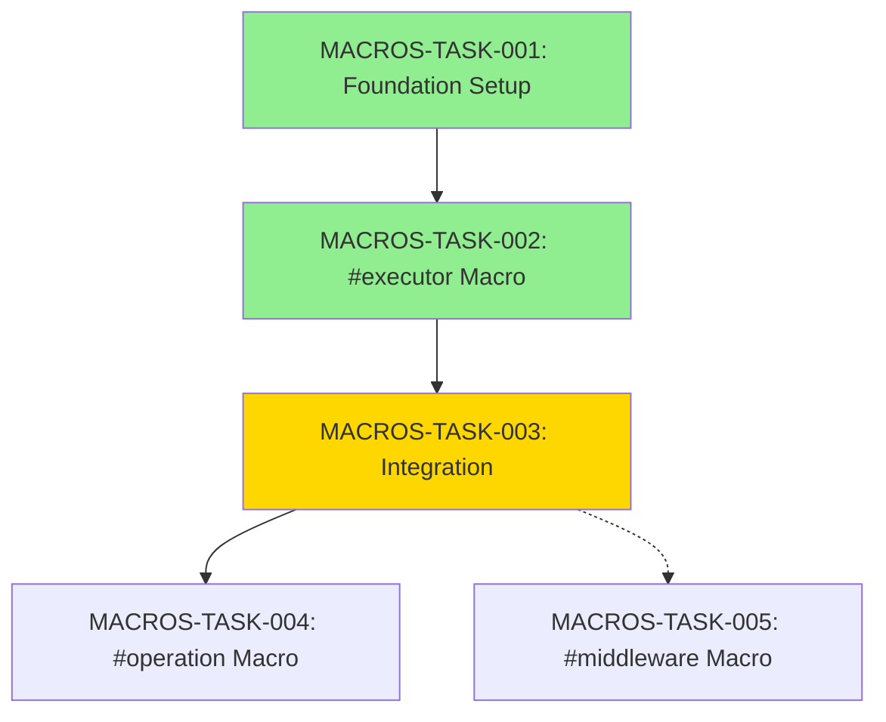

# Task Index

## Active Tasks

### MACROS-TASK-003: Integration with airssys-osl
**Status:** 🔄 In Progress - Phase 1 Complete (2025-10-09)  
**Priority:** High  
**File:** [MACROS-TASK-003-integration.md](./MACROS-TASK-003-integration.md)
**Progress:** 25% (Phase 1 of 4 complete)
**Current Phase:** Phase 2 - Integration Tests (Ready to start)

## Completed Tasks

### MACROS-TASK-002: Implement #[executor] Macro
**Status:** ✅ Complete (2025-10-08)  
**Priority:** High  
**File:** [MACROS-TASK-002-executor-macro.md](./MACROS-TASK-002-executor-macro.md)
**Deliverables:**
- ✅ 27 unit tests passing
- ✅ Full operation mapping (11 operations)
- ✅ Code generation working
- ✅ Zero warnings, production ready

### MACROS-TASK-001: Foundation Setup and Workspace Integration
**Status:** ✅ Complete (2025-10-08)  
**Priority:** Critical  
**File:** [MACROS-TASK-001-foundation-setup.md](./MACROS-TASK-001-foundation-setup.md)

## Planned Tasks

### MACROS-TASK-004: #[operation] Derive Macro (Future)
**Status:** Planned  
**Priority:** Medium  
**File:** Not yet created

### MACROS-TASK-005: #[middleware] Macro (Maybe)
**Status:** Maybe  
**Priority:** Low  
**File:** Not yet created

## Completed Tasks

### MACROS-TASK-001: Foundation Setup and Workspace Integration
**Status:** ✅ Complete  
**Completed:** 2025-10-08  
**Priority:** Critical  
**File:** [MACROS-TASK-001-foundation-setup.md](./MACROS-TASK-001-foundation-setup.md)

## Task Dependencies

## Task Status Summary

| Task ID | Name | Status | Priority | Effort | Completion |
|---------|------|--------|----------|--------|------------|
| MACROS-TASK-001 | Foundation Setup | ✅ Complete | Critical | 4h | 100% |
| MACROS-TASK-002 | #[executor] Macro | ✅ Complete | High | 10d | 100% |
| MACROS-TASK-003 | Integration | 🔄 In Progress | High | 1-2d | 25% |
| MACROS-TASK-004 | #[operation] Macro | Planned | Medium | 1-2w | 0% |
| MACROS-TASK-005 | #[middleware] Macro | Maybe | Low | 1-2w | 0% |

## Related Tasks in Other Sub-Projects

### airssys-osl
- **OSL-TASK-009**: Remove Framework and Add Helpers (Can proceed in parallel)
- **OSL-TASK-008**: Platform Executors (✅ COMPLETE - provides executors to test macros)
