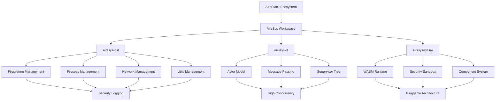

# AirsSys Workspace Architecture

## High-Level Structure

```
airssys/
├── airssys-osl/              # OS Layer Framework
├── airssys-rt/               # Runtime (Erlang-Actor Model)
└── airssys-wasm/             # WASM Pluggable System
```

## Component Relationships



## Integration Points

### airssys-osl ↔ airssys-rt
- **Process Management**: OSL provides process primitives, RT manages actor lifecycle
- **Resource Allocation**: OSL handles system resources, RT coordinates resource usage
- **Security Context**: Shared security policies and audit logging

### airssys-osl ↔ airssys-wasm
- **Sandboxing**: OSL provides isolation primitives, WASM implements secure execution
- **Resource Limits**: OSL enforces system limits, WASM manages component resources
- **File System Access**: OSL mediates file system operations for WASM components

### airssys-rt ↔ airssys-wasm
- **Actor-Component Bridge**: RT actors can host WASM components
- **Message Routing**: RT message passing extended to WASM component communication
- **Lifecycle Management**: RT supervisors can manage WASM component lifecycle

## Cross-Cutting Concerns

### Security Architecture
- **Defense in Depth**: Multiple security layers across all components
- **Audit Trail**: Comprehensive activity logging from OSL layer
- **Least Privilege**: Minimal permissions by default
- **Secure Defaults**: All configurations default to secure settings

### Performance Architecture
- **Zero-Copy Operations**: Minimize data copying between components
- **Async-First**: All I/O operations use async/await patterns
- **Resource Pooling**: Efficient resource reuse across components
- **Benchmarking**: Continuous performance monitoring and optimization

### Error Handling Architecture
- **Structured Errors**: Consistent error types across all components
- **Error Propagation**: Clear error propagation chains
- **Recovery Strategies**: Graceful degradation and recovery mechanisms
- **Observability**: Rich error context for debugging and monitoring

## Development Architecture

### Build System
- **Workspace Cargo.toml**: Unified dependency management
- **Feature Flags**: Conditional compilation for different environments
- **Cross-Platform**: Support for Linux, macOS, and Windows
- **CI/CD Integration**: Automated testing and deployment pipelines

### Testing Architecture
- **Unit Tests**: Component-level testing within each crate
- **Integration Tests**: Cross-component interaction testing
- **Performance Tests**: Benchmarking and performance regression testing
- **Security Tests**: Penetration testing and security validation

### Documentation Architecture
- **API Documentation**: Comprehensive rustdoc for all public APIs
- **Architectural Decision Records**: Decision tracking and rationale
- **Usage Examples**: Practical examples for each component
- **Integration Guides**: Component integration and usage patterns