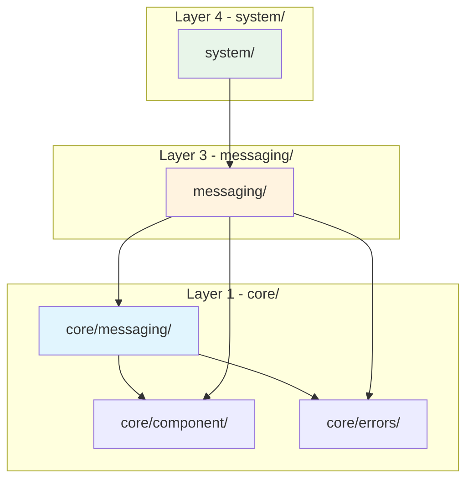

# KNOWLEDGE-WASM-040: Messaging Module - Comprehensive Reference

**Document ID:** KNOWLEDGE-WASM-040  
**Created:** 2026-01-09  
**Status:** Active  
**Category:** Architecture / Messaging / Reference  
**Maturity:** Stable  
**Priority:** 🔴 CRITICAL

---

## Document Purpose

This is the **definitive reference** for the messaging module in airssys-wasm. All development tasks related to messaging MUST reference this document to ensure alignment with the architectural design.

**Use this document when:**
- Planning messaging-related tasks
- Implementing messaging features
- Reviewing messaging code
- Understanding inter-component communication

---

## Overview

### What is the Messaging Module?

The messaging module is responsible for **inter-component communication**. It enables WASM components to talk to each other through the host runtime, following **actor model** principles.

```
┌─────────────────────────────────────────────────────────────────────────┐
│                        MESSAGING MODULE PURPOSE                          │
│                                                                         │
│   "Enable WASM components to communicate with each other through        │
│    a push-based, actor-style message passing system"                    │
└─────────────────────────────────────────────────────────────────────────┘
```

### Core Responsibilities

| Responsibility | Description |
|:---|:---|
| **Message Routing** | Route messages from sender to receiver component |
| **Correlation Tracking** | Track request-response pairs with unique IDs |
| **Pattern Support** | Support fire-and-forget and request-response patterns |
| **Timeout Management** | Enforce timeouts on pending requests |

---

## Architecture Layers

The messaging module follows the **two-layer architecture** pattern used throughout airssys-wasm:

```
┌─────────────────────────────────────────────────────────────────────────┐
│                           LAYER 1: core/messaging/                       │
│                                                                         │
│   Contains: ABSTRACTIONS (traits, types, errors)                        │
│   Purpose:  Define contracts that other modules depend on               │
│   Imports:  core/component/, std, external crates (thiserror, uuid)     │
│   Never:    Import from messaging/ or other implementation modules      │
│                                                                         │
│   Files:                                                                │
│   ├── errors.rs         → MessagingError (co-located!)                 │
│   ├── correlation.rs    → CorrelationId type                           │
│   ├── traits.rs         → MessageRouter, CorrelationTracker traits     │
│   └── mod.rs            → Module declarations                          │
└─────────────────────────────────────────────────────────────────────────┘
                                     │
                                     │ (dependency flows DOWN)
                                     ▼
┌─────────────────────────────────────────────────────────────────────────┐
│                           LAYER 3: messaging/                            │
│                                                                         │
│   Contains: IMPLEMENTATIONS (concrete types)                            │
│   Purpose:  Implement the traits defined in core/messaging/             │
│   Imports:  core/, airssys-rt, tokio                                    │
│   Never:    Import from system/ or be imported by core/                 │
│                                                                         │
│   Files:                                                                │
│   ├── patterns.rs       → FireAndForget, RequestResponse patterns      │
│   ├── correlation.rs    → CorrelationTrackerImpl                       │
│   ├── router.rs         → ResponseRouter (impl MessageRouter)          │
│   ├── subscriber.rs     → ComponentSubscriber                          │
│   └── mod.rs            → Module declarations                          │
└─────────────────────────────────────────────────────────────────────────┘
```

> **Design Decision: Co-located Errors**
> 
> Each core module contains its own error types in an `errors.rs` file:
> - `core/messaging/errors.rs` → `MessagingError`
> - `core/runtime/errors.rs` → `WasmError`
> - `core/security/errors.rs` → `SecurityError`
> - `core/storage/errors.rs` → `StorageError`
> 
> This provides module isolation - no cross-dependencies within `core/`.

### Dependency Flow



**Key Principle:** Modules depend on **abstractions** (traits in `core/`), not **implementations**. The `system/` module injects concrete implementations at runtime.

---

## Messaging Patterns

### Two Supported Patterns

```
┌─────────────────────────────────────────────────────────────────────────┐
│                         MESSAGING PATTERNS                               │
│                                                                         │
│   ┌─────────────────────────────┐   ┌─────────────────────────────┐    │
│   │    FIRE-AND-FORGET          │   │    REQUEST-RESPONSE         │    │
│   ├─────────────────────────────┤   ├─────────────────────────────┤    │
│   │ API: send(target, payload)  │   │ API: request(target,        │    │
│   │                             │   │      payload, timeout)      │    │
│   ├─────────────────────────────┤   ├─────────────────────────────┤    │
│   │ Returns: Ok(())             │   │ Returns: Ok(CorrelationId)  │    │
│   ├─────────────────────────────┤   ├─────────────────────────────┤    │
│   │ Response: IGNORED           │   │ Response: CAPTURED          │    │
│   │           (no callback)     │   │           (via callback)    │    │
│   ├─────────────────────────────┤   ├─────────────────────────────┤    │
│   │ Use Case:                   │   │ Use Case:                   │    │
│   │ - Events/notifications      │   │ - RPC calls                 │    │
│   │ - Logging                   │   │ - Data queries              │    │
│   │ - Status updates            │   │ - Validation requests       │    │
│   ├─────────────────────────────┤   ├─────────────────────────────┤    │
│   │ Latency: ~280ns             │   │ Latency: ~560ns (round-trip)│    │
│   └─────────────────────────────┘   └─────────────────────────────┘    │
└─────────────────────────────────────────────────────────────────────────┘
```

### Pattern 1: Fire-and-Forget

```
┌─────────────┐         ┌──────────────┐         ┌─────────────┐
│ Component A │         │ Host Runtime │         │ Component B │
│  (Sender)   │         │   (Router)   │         │ (Receiver)  │
└──────┬──────┘         └──────┬───────┘         └──────┬──────┘
       │                       │                        │
       │ send(B, payload)      │                        │
       │──────────────────────>│                        │
       │                       │                        │
       │ Ok(())                │ 1. Check capability    │
       │<──────────────────────│ 2. Route to target     │
       │ (returns immediately) │ 3. NO callback setup   │
       │                       │                        │
       │                       │ handle_message(A, msg) │
       │                       │───────────────────────>│
       │                       │                        │
       │                       │      Ok(response)      │
       │                       │<───────────────────────│
       │                       │      (IGNORED!)        │
       │                       │                        │
```

**Characteristics:**
- Sender returns immediately with `Ok(())`
- No correlation ID tracked
- Receiver's return value is **IGNORED**
- Fastest path, minimal overhead

### Pattern 2: Request-Response

```
┌─────────────┐         ┌──────────────┐         ┌─────────────┐
│ Component A │         │ Host Runtime │         │ Component B │
│ (Requester) │         │   (Router)   │         │ (Responder) │
└──────┬──────┘         └──────┬───────┘         └──────┬──────┘
       │                       │                        │
       │ request(B,req,5000ms) │                        │
       │──────────────────────>│                        │
       │                       │                        │
       │                       │ 1. Check capability    │
       │                       │ 2. Generate corr_id    │
       │                       │ 3. Register callback   │
       │                       │ 4. Start timeout       │
       │                       │                        │
       │ Ok(corr_id)           │                        │
       │<──────────────────────│                        │
       │ (returns immediately) │                        │
       │                       │                        │
       │                       │ handle_message(A, req) │
       │                       │───────────────────────>│
       │                       │                        │
       │                       │                        │ Process
       │                       │                        │ request
       │                       │                        │
       │                       │      Ok(response)      │
       │                       │<───────────────────────│
       │                       │      (CAPTURED!)       │
       │                       │                        │
       │                       │ 5. Match correlation   │
       │                       │ 6. Route to callback   │
       │                       │                        │
       │ handle_callback(      │                        │
       │   corr_id,            │                        │
       │   Ok(response)        │                        │
       │ )                     │                        │
       │<──────────────────────│                        │
```

**Characteristics:**
- Sender returns immediately with `Ok(correlation_id)`
- Correlation ID tracked by host runtime
- Receiver's return value is **CAPTURED** and routed back
- Timeout enforced by runtime

---

## Critical Insight: No send-response Function

> **There is NO `send-response` host function!**
> 
> The response IS the return value from `handle_message`. The runtime decides what to do with this return value based on how the message was sent.

### Same Export, Different Behavior

Component B implements the **SAME** `handle_message` export for BOTH patterns:

```rust
// Component B - handles BOTH patterns with the SAME function!
#[export]
fn handle_message(sender: ComponentId, message: Vec<u8>) -> Result<Vec<u8>, Error> {
    // Component B doesn't know if this is fire-and-forget or request-response!
    // It just processes the message and returns a result.
    
    let data = decode(message)?;
    let result = process(data)?;
    
    Ok(encode(result)?)
    // ↑ If fire-and-forget: Runtime IGNORES this
    // ↑ If request-response: Runtime CAPTURES this and routes to callback
}
```

---

## Type Definitions

### core/messaging/ Types

#### CorrelationId

```rust
/// Unique identifier for correlating request-response pairs.
#[derive(Debug, Clone, PartialEq, Eq, Hash)]
pub struct CorrelationId(String);

impl CorrelationId {
    /// Create a new CorrelationId from a string.
    pub fn new(id: impl Into<String>) -> Self;
    
    /// Generate a new unique CorrelationId using UUID v4.
    pub fn generate() -> Self;
    
    /// Returns the correlation ID as a string slice.
    pub fn as_str(&self) -> &str;
}
```

#### MessageRouter Trait

```rust
/// Trait for message routing between components.
/// Implemented by: messaging/router.rs (ResponseRouter)
pub trait MessageRouter: Send + Sync {
    /// Send a fire-and-forget message.
    fn send(
        &self,
        target: &ComponentId,
        payload: MessagePayload,
    ) -> Result<(), MessagingError>;

    /// Send a request expecting a response.
    fn request(
        &self,
        target: &ComponentId,
        payload: MessagePayload,
        timeout_ms: u64,
    ) -> Result<CorrelationId, MessagingError>;

    /// Cancel a pending request.
    fn cancel_request(
        &self,
        correlation_id: &CorrelationId,
    ) -> Result<(), MessagingError>;
}
```

#### CorrelationTracker Trait

```rust
/// Trait for tracking request-response correlations.
/// Implemented by: messaging/correlation.rs (CorrelationTrackerImpl)
pub trait CorrelationTracker: Send + Sync {
    /// Register a pending request.
    fn register(
        &self,
        correlation_id: &CorrelationId,
        timeout_ms: u64,
    ) -> Result<(), MessagingError>;

    /// Complete a pending request with a response.
    fn complete(
        &self,
        correlation_id: &CorrelationId,
        response: MessagePayload,
    ) -> Result<(), MessagingError>;

    /// Check if a correlation is still pending.
    fn is_pending(&self, correlation_id: &CorrelationId) -> bool;

    /// Remove a correlation without completing it.
    fn remove(
        &self,
        correlation_id: &CorrelationId,
    ) -> Result<(), MessagingError>;
}
```

---

## Error Types (from core/errors/messaging.rs)

```rust
/// Messaging errors
#[derive(Debug, Clone, Error)]
pub enum MessagingError {
    #[error("Message delivery failed: {0}")]
    DeliveryFailed(String),

    #[error("Correlation timeout: {0}")]
    CorrelationTimeout(String),

    #[error("Invalid message: {0}")]
    InvalidMessage(String),

    #[error("Message queue is full")]
    QueueFull,

    #[error("Target component not found: {0}")]
    TargetNotFound(String),
}
```

---

## Implementation Module Structure (messaging/)

```
messaging/
├── mod.rs            # Module declarations
├── patterns.rs       # FireAndForget, RequestResponse pattern helpers
├── correlation.rs    # CorrelationTrackerImpl
├── router.rs         # ResponseRouter (implements MessageRouter)
└── subscriber.rs     # ComponentSubscriber (mailbox management)
```

### Key Implementation Types

| Type | Location | Purpose |
|:---|:---|:---|
| `CorrelationTrackerImpl` | `messaging/correlation.rs` | Tracks pending requests with timeouts |
| `ResponseRouter` | `messaging/router.rs` | Routes messages between components |
| `ComponentSubscriber` | `messaging/subscriber.rs` | Manages component mailbox senders |
| `FireAndForget` | `messaging/patterns.rs` | Helper for fire-and-forget pattern |
| `RequestResponse` | `messaging/patterns.rs` | Helper for request-response pattern |

---

## WIT Interface Definition

### Component Exports (what components implement)

```wit
interface component-lifecycle {
    // Same export handles BOTH patterns
    handle-message: func(
        sender: component-id,
        message: list<u8>
    ) -> result<list<u8>, component-error>;
    
    // Only requester implements this (for request-response)
    handle-callback: func(
        request-id: string,
        callback-result: result<list<u8>, string>
    ) -> result<_, component-error>;
}
```

### Host Services (what components call)

```wit
interface host-services {
    // Pattern 1: Fire-and-forget
    send-message: func(
        target: component-id,
        message: list<u8>
    ) -> result<_, messaging-error>;
    
    // Pattern 2: Request-response
    send-request: func(
        target: component-id,
        request: list<u8>,
        timeout-ms: u64
    ) -> result<string, messaging-error>;  // Returns correlation ID
    
    // Cancel pending request
    cancel-request: func(
        request-id: string
    ) -> result<_, messaging-error>;
    
    // NOTE: NO send-response function! Response is return value.
}
```

---

## Dependency Injection Flow

```
┌────────────────────────────────────────────────────────────────────────┐
│                      system/ (Layer 4)                                  │
│  Creates concrete types and injects into Layer 3                       │
│                                                                        │
│  let tracker: Arc<dyn CorrelationTracker> =                           │
│      Arc::new(CorrelationTrackerImpl::new());                          │
│  let router: Arc<dyn MessageRouter> =                                  │
│      Arc::new(ResponseRouter::new(registry, tracker));                 │
└────────────────────────────────────────────────────────────────────────┘
                               │
                               ▼ (injects)
┌────────────────────────────────────────────────────────────────────────┐
│                  messaging/ (Layer 3)                                   │
│  Uses Arc<dyn MessageRouter> - never knows concrete type               │
└────────────────────────────────────────────────────────────────────────┘
                               │
                               ▼ (depends on)
┌────────────────────────────────────────────────────────────────────────┐
│                  core/messaging/ (Layer 1)                              │
│  Defines traits: MessageRouter, CorrelationTracker                     │
└────────────────────────────────────────────────────────────────────────┘
```

---

## Who Uses What?

| Who | Action | Uses |
|:---|:---|:---|
| **External components/plugins** | Call `send-message`/`send-request` | Host functions |
| **External components/plugins** | Export `handle_message` | Component lifecycle |
| **Internal `messaging/` module** | Implement routing | `MessageRouter`, `CorrelationTracker` traits |
| **Internal `component/` module** | Send messages on behalf of components | `MessageRouter` trait |
| **Internal `system/` module** | Inject implementations | Concrete types |

---

## Complete Message Flow (10 Steps)

```
┌─────────────────────────────────────────────────────────────────────────┐
│                    COMPLETE REQUEST-RESPONSE FLOW                        │
└─────────────────────────────────────────────────────────────────────────┘

 STEP 1                    STEP 2                    STEP 3
┌──────────┐           ┌──────────────┐          ┌───────────────┐
│ WASM     │  send_    │ HostFunctions│  route   │ MessageRouter │
│ Component├──request──►│ (runtime/)   ├─────────►│ (messaging/)  │
│ A        │           └──────────────┘          └───────┬───────┘
└──────────┘                                             │
                                                         │ STEP 4
                                                         ▼
                                            ┌───────────────────┐
                                            │ CorrelationTracker│
                                            │ register(id,      │
                                            │   timeout)        │
                                            └─────────┬─────────┘
                                                      │ STEP 5
                                                      ▼
                                            ┌───────────────────┐
                                            │ ComponentSubscriber│
                                            │ deliver(B, msg)   │
                                            └─────────┬─────────┘
                                                      │ STEP 6
                                                      ▼
                                            ┌───────────────────┐
                                            │ airssys-rt        │
                                            │ ActorSystem       │
                                            │ send to mailbox   │
                                            └─────────┬─────────┘
                                                      │ STEP 7
                                                      ▼
┌──────────┐                                ┌───────────────────┐
│ WASM     │                                │ ComponentWrapper  │
│ Component│◄───handle_message(A, req)──────│ (Actor)           │
│ B        │                                └───────────────────┘
└────┬─────┘
     │ STEP 8: Returns Ok(response)
     ▼
┌───────────────────┐   STEP 9         ┌───────────────────┐
│ Runtime           │  detect          │ CorrelationTracker│
│ (captures return) ├──correlation_id──►│ complete(id,      │
└─────────┬─────────┘                  │   response)       │
          │                            └───────────────────┘
          │ STEP 10
          ▼
┌──────────┐
│ WASM     │◄───handle_callback(corr_id, Ok(response))
│ Component│
│ A        │
└──────────┘
```

---

## Performance Characteristics

| Pattern | Latency | Correlation Overhead | Memory |
|:---|:---|:---|:---|
| Fire-and-forget | ~280ns | None | Minimal |
| Request-response | ~560ns | HashMap lookup + timeout timer | ~100 bytes per pending |

---

## Related Documentation

### ADRs
- **ADR-WASM-009**: Component Communication Model
- **ADR-WASM-024**: Messaging Module Refactoring
- **ADR-WASM-031**: Component & Messaging Module Design

### Knowledge Documents
- **KNOWLEDGE-WASM-005**: Inter-Component Messaging Architecture
- **KNOWLEDGE-WASM-024**: Component Messaging Clarifications
- **KNOWLEDGE-WASM-029**: Messaging Patterns (Fire-and-Forget vs Request-Response)
- **KNOWLEDGE-WASM-037**: Rebuild Architecture - Clean Slate Design

### Tasks
- **WASM-TASK-019**: Create core/messaging/ Submodule
- **WASM-TASK-022**: Create core/errors/ Submodule (includes MessagingError)

---

## Verification Checklist

When implementing or reviewing messaging code:

- [ ] Traits defined in `core/messaging/`, implementations in `messaging/`
- [ ] `core/messaging/` does NOT import from `messaging/`
- [ ] All types are `Send + Sync` for thread safety
- [ ] `CorrelationId` uses `uuid` crate for generation
- [ ] Import organization follows §2.1 (3-layer pattern)
- [ ] `mod.rs` files contain only module declarations (no glob re-exports)
- [ ] Fire-and-forget ignores return value
- [ ] Request-response captures and routes return value
- [ ] Timeouts are enforced by runtime
- [ ] Error types use `thiserror` derive macro

---

## History

| Date | Version | Change |
|------|---------|--------|
| 2026-01-09 | 1.0 | Initial comprehensive reference document |

---

**This document is the definitive reference for all messaging-related development in airssys-wasm.**
