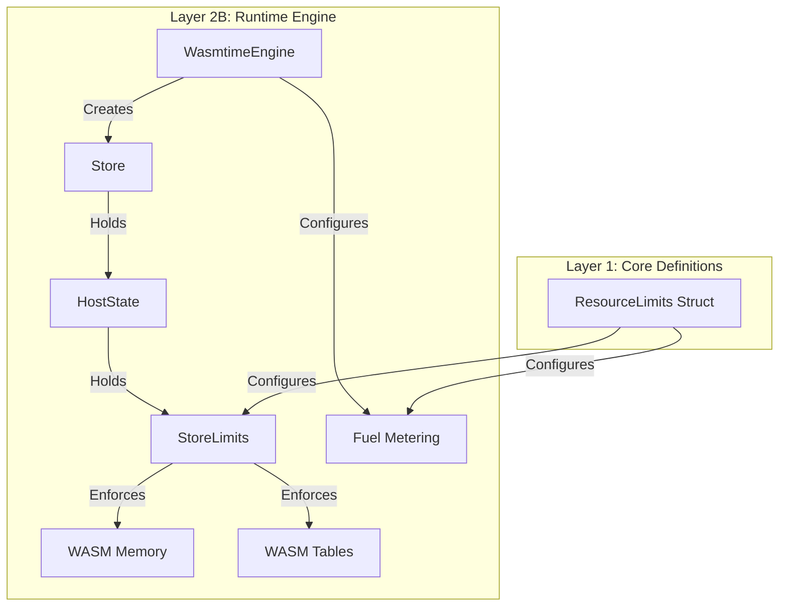

# KNOWLEDGE-WASM-044: WasmTime Resource Limiter Architecture

**Created:** 2026-01-16
**Status:** DRAFT
**Context:** Middleware/Runtime Layer

## 1. Executive Summary

This document details the architecture and implementation of resource limiting in the `airssys-wasm` runtime using Wasmtime's `StoreLimits` and Fuel consumption mechanisms. It explains how these fundamental concepts protect the host system from malicious or buggy WASM components by enforcing strict bounds on memory usage, table growth, and CPU execution time.

## 2. Fundamental Concepts

### 2.1 The Need for Resource Limits
WebAssembly components execute untrusted code. Without limits, a component could:
- **Exhaust Memory**: Allocate all available host RAM (OOM DoS).
- **Infinite Loop**: Consume 100% CPU indefinitely (CPU DoS).
- **Resource Starvation**: Prevent other components from executing.

### 2.2 Wasmtime Mechanisms
Wasmtime provides two primary mechanisms for resource control:

1.  **StoreLimits (Memory & Tables)**:
    - Deterministic limits on linear memory size and table elements.
    - Enforced synchronously during `memory.grow` or `table.grow` instructions.
    - Managed via the `wasmtime::ResourceLimiter` trait.

2.  **Fuel (CPU/Execution Time)**:
    - Deterministic execution metering.
    - Each WASM instruction costs "fuel" (usually 1 unit).
    - Execution traps (halts) when fuel reaches zero.
    - Prevents infinite loops and long-running computations.

## 3. Architecture Overview

The resource limiting architecture integrates into the `RuntimeEngine` (Layer 2B) and bridges `core` types with `wasmtime` implementation.



### 3.1 Data Flow
1.  **Configuration**: User/System defines `core::runtime::limits::ResourceLimits`.
2.  **Initialization**: `WasmtimeEngine` creates a `Store` with `HostState`.
3.  **Application**: `ResourceLimits` are converted into `StoreLimits` and set in `HostState`.
4.  **Enforcement**:
    - **Memory**: WASM executes `memory.grow`. Wasmtime calls `HostState::memory_growing`. `StoreLimits` checks limit.
    - **CPU**: WASM executes instructions. Wasmtime decrements Store fuel. Traps if 0.

## 4. Component Model Integration

In the Component Model, resources are bound to a `Store`. A Component Instance lives within a Store, and all its sub-instances share that Store's resources.

### 4.1 HostState Responsibility
The `HostState` struct acts as the bridge. It lives in the `Store`'s custom data slot.

```rust
// airssys-wasm/src/runtime/engine.rs

pub struct HostState {
    pub limits: StoreLimits, // <--- The actual limiter logic
    // ...
}

// Crucial: Wasmtime looks for this trait implementation
impl wasmtime::ResourceLimiter for HostState {
    fn memory_growing(&mut self, current: usize, desired: usize, maximum: Option<usize>) -> Result<bool> {
        self.limits.memory_growing(current, desired, maximum)
    }
    
    fn table_growing(&mut self, current: u32, desired: u32, maximum: Option<u32>) -> Result<bool> {
        self.limits.table_growing(current, desired, maximum)
    }
}
```

### 4.2 Configuration Hook
When creating the Store, we must tell Wasmtime *how* to find the limiter:

```rust
let mut store = Store::new(&engine, host_state);
store.limiter(|state| &mut state.limits); // <--- The magic hook
```

## 5. Detailed Implementation Examples

### 5.1 Defining Limits (Core)
```rust
// src/core/runtime/limits.rs
pub struct ResourceLimits {
    pub max_memory_bytes: u64, // e.g., 64MB
    pub max_fuel: Option<u64>, // e.g., 1,000,000 instructions
}
```

### 5.2 Building StoreLimits (Runtime)
The `WasmResourceLimiter` helper converts core types to Wasmtime types.

```rust
// src/runtime/limiter.rs
impl WasmResourceLimiter {
    pub fn new(limits: &ResourceLimits) -> Self {
        let builder = StoreLimitsBuilder::new();
        let builder = builder.memory_size(limits.max_memory_bytes as usize);
        Self { limits: builder.build() }
    }
}
```

### 5.3 Applying Fuel
Fuel is managed directly on the Store, not via `StoreLimits`.

```rust
// src/runtime/limiter.rs
pub fn apply_to_store(store: &mut Store<HostState>, limits: &ResourceLimits) {
    // 1. Set Memory Limits
    store.data_mut().limits = WasmResourceLimiter::new(limits).into_inner();
    
    // 2. Set Fuel Limits
    if let Some(fuel) = limits.max_fuel {
        store.set_fuel(fuel).expect("Fuel consumption must be enabled in Config");
    }
}
```

## 6. Verification & Testing

### 6.1 Memory Exhaustion Test
To verify memory limits, we can use an inline WAT component that attempts to grow memory beyond the limit.

```rust
// WAT: Try to grow memory by 2 pages (128KB)
(memory (export "memory") 1) 
(func (export "grow") (memory.grow (i32.const 2)))
```
**Expected Result**: `RuntimeError` (memory limit exceeded).

### 6.2 Infinite Loop (Fuel) Test
To verify fuel limits, we use an infinite loop.

```rust
// WAT: Infinite loop
(func (export "loop") (loop (br 0)))
```
**Expected Result**: `RuntimeError` (all fuel consumed).

## 7. Best Practices

1.  **Always Enable Fuel**: Without fuel or epoch interruption, a WASM component can hang the host thread forever.
2.  **Conservative Defaults**: Start with restrictive limits (e.g., 64MB RAM, 1s execution) and increase only if needed.
3.  **Handle Traps Gracefully**: Resource exhaustion traps are expected behavior for malicious inputs. Catch them and return proper error codes, do not panic.
4.  **Sync vs Async**: `StoreLimits` works for both sync and async execution. Fuel works for both.

## 8. References
- [Wasmtime Documentation: Resource Limiting](https://docs.wasmtime.dev/examples-rust-resource-limiting.html)
- [Wasmtime Documentation: Fuel](https://docs.wasmtime.dev/examples-rust-fuel.html)
- ADR-WASM-030 (Runtime Module Design)
