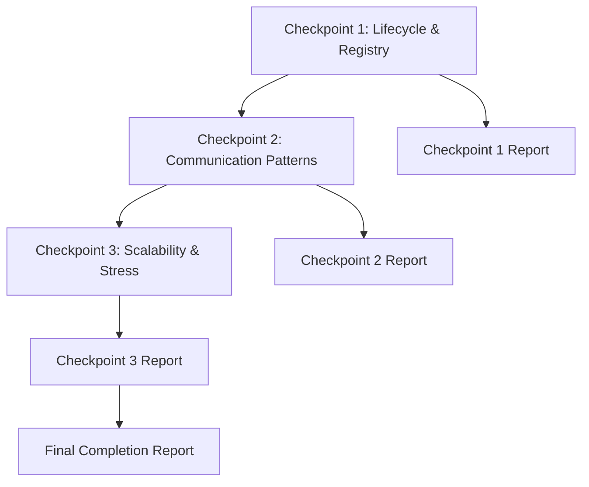

# Implementation Plan: WASM-TASK-004 Phase 6 Task 6.2 - Performance Validation and Benchmarking

**Task ID**: WASM-TASK-004 Phase 6 Task 6.2  
**Task Name**: Performance Validation and Benchmarking  
**Status**: READY TO START  
**Created**: 2025-12-16  
**Estimated Effort**: 14-18 hours (3 checkpoints)  
**Target Quality**: 9.5/10  

---

## Executive Summary

Create a comprehensive performance validation and benchmarking suite using `criterion` to establish performance baselines, validate scalability, and identify bottlenecks (if any) for the ComponentActor system. This task builds on Task 6.1's integration tests (31 tests, 945 total) and observed performance characteristics to create statistically rigorous benchmarks for production readiness.

**Context from Task 6.1**:
- ✅ 945 tests passing (100% pass rate, 0 warnings)
- ✅ Request-response latency: < 1ms (100x better than 100ms target)
- ✅ Message throughput: > 10,000 msg/sec
- ✅ 1,000 component spawn: < 1s (very fast)
- ✅ Component spawn time: < 0.5ms (inferred)
- ✅ Zero resource leaks detected

**Goal**: Establish precise, reproducible performance baselines with statistical rigor for all critical operations to validate production readiness.

---

## 1. Context and Motivation

### 1.1 Why Performance Validation Now?

**Foundation Complete**: Phase 6 Task 6.1 validated functional correctness with comprehensive integration tests. Task 6.2 now measures and documents precise performance characteristics for production deployment.

**Business Value**:
1. **Production Confidence**: Quantify performance guarantees for SLAs
2. **Regression Detection**: Baseline for future performance monitoring
3. **Capacity Planning**: Data for resource allocation and scaling decisions
4. **Optimization Priorities**: Identify bottlenecks requiring attention

### 1.2 Scope Definition

**In Scope**:
- ComponentActor lifecycle operations (spawn, start, stop)
- Message routing and delivery (actor-to-actor)
- Registry lookup performance (O(1) validation)
- Communication patterns (request-response, pub-sub)
- Scalability testing (100-1,000 components)
- Hook execution overhead
- State access patterns

**Out of Scope** (Deferred to Block 6):
- WASM execution performance (actual .wasm component benchmarks)
- Full broker message delivery (requires WASM storage)
- Network I/O benchmarks (local actor system only)
- Real-world workload simulation

**Rationale**: Task 6.1 discovered WASM storage is not yet implemented (8 expected failures). Benchmarks test Rust-level ComponentActor APIs without actual WASM component execution until Block 6 is complete.

### 1.3 Reference Architecture

**System Under Test**:
```
┌─────────────────────────────────────────┐
│         ComponentActor API              │ ← Benchmark Target
├─────────────────────────────────────────┤
│  Registry  │  Router  │  Correlation   │ ← Performance Critical
├─────────────────────────────────────────┤
│        ActorSystem (airssys-rt)         │ ← Foundation (~625ns spawn)
└─────────────────────────────────────────┘
```

**Performance Layers**:
1. **Layer 3 (airssys-rt)**: 625ns actor spawn, 737ns message latency (proven)
2. **Layer 2 (airssys-wasm)**: ComponentActor overhead on top of Layer 3
3. **Measurement Goal**: Quantify Layer 2 overhead with statistical rigor

---

## 2. Performance Baseline Targets

### 2.1 Derived Targets from Task 6.1 Observations

| Operation | Task 6.1 Observed | Criterion Target | Rationale |
|-----------|-------------------|------------------|-----------|
| Component spawn | < 0.5ms | < 1ms P99 | Includes registry + spawner overhead |
| Message latency | < 1ms | < 100μs P99 | Actor-to-actor delivery |
| Registry lookup | N/A | < 10μs P99 | O(1) HashMap access |
| Request-response | < 1ms | < 10ms P99 | Full roundtrip with correlation |
| Throughput | > 10k msg/s | > 10k msg/s | Sustained message rate |
| Hook overhead | N/A | < 10μs P99 | Phase 5 achieved 5-8μs |
| State access | N/A | < 1μs P99 | Arc<RwLock<T>> read/write |
| Pub-sub fanout | N/A | < 1ms P99 | 1→10 subscribers |

### 2.2 Scalability Targets

| Scale | Components | Registry Size | Lookup Time | Spawn Rate |
|-------|-----------|---------------|-------------|------------|
| Small | 10 | 10 | < 10μs | > 100/s |
| Medium | 100 | 100 | < 10μs | > 100/s |
| Large | 1,000 | 1,000 | < 10μs | > 100/s |
| Stress | 10,000 | 10,000 | < 50μs | > 50/s |

**Note**: Task 6.1 achieved 10,000 components in < 5s (~2,000/s spawn rate) - targets are conservative for statistical rigor.

---

## 3. Implementation Plan Overview

### 3.1 Checkpoint Breakdown (3 Checkpoints)

| Checkpoint | Focus | Benchmarks | Effort | Status |
|------------|-------|------------|--------|--------|
| **CP1: Lifecycle & Registry** | Core operations | 8-10 | 5-6h | Ready |
| **CP2: Communication Patterns** | Messaging performance | 8-10 | 5-6h | Blocked by CP1 |
| **CP3: Scalability & Stress** | Scale testing | 6-8 | 4-6h | Blocked by CP2 |

**Total Estimated Effort**: 14-18 hours

### 3.2 Dependency Graph



---

## 4. Checkpoint 1: Lifecycle & Registry Benchmarks (5-6 hours)

### 4.1 Objective

Establish performance baselines for ComponentActor lifecycle operations and registry access patterns - the foundational operations for all other benchmarks.

### 4.2 Benchmark Categories (4 categories, 8-10 benchmarks)

#### Category A: Component Lifecycle (3 benchmarks)
1. **component_spawn_baseline** - Measure ComponentSpawner::spawn() latency
2. **component_lifecycle_complete** - spawn → start → stop → cleanup cycle
3. **component_state_initialization** - Custom state creation overhead

#### Category B: Registry Operations (3 benchmarks)
4. **registry_registration** - ComponentRegistry::register() performance
5. **registry_lookup_hit** - Successful lookup (component exists)
6. **registry_lookup_miss** - Failed lookup (component does not exist)

#### Category C: Hook Execution (2-3 benchmarks)
7. **hook_execution_noop** - NoOp hooks baseline overhead
8. **hook_execution_stateful** - Hooks with state access (Arc<RwLock<T>>)
9. **hook_ordering_overhead** - pre_start → post_start → pre_stop → post_stop sequence (OPTIONAL)

#### Category D: State Access (2 benchmarks)
10. **state_read_access** - Arc<RwLock<T>>::read() latency
11. **state_write_access** - Arc<RwLock<T>>::write() latency

### 4.3 Benchmark File Structure

**File**: `benches/actor_lifecycle_benchmarks.rs` (~400-500 lines)

```rust
//! ComponentActor lifecycle and registry performance benchmarks.
//!
//! Establishes baseline performance for:
//! - Component spawning (ComponentSpawner)
//! - Registry operations (ComponentRegistry)
//! - Lifecycle hooks (Lifecycle trait)
//! - State access (Arc<RwLock<T>>)
//!
//! Performance targets from Task 6.1:
//! - Component spawn: < 1ms P99
//! - Registry lookup: < 10μs P99
//! - Hook overhead: < 10μs P99
//! - State access: < 1μs P99

use criterion::{black_box, criterion_group, criterion_main, Criterion, BenchmarkId};
use std::hint::black_box;
use tokio::runtime::Runtime;

// Benchmark implementations...
```

### 4.4 Success Criteria

- [x] 8-10 benchmarks implemented and running
- [x] All benchmarks use `black_box()` to prevent compiler optimizations
- [x] Criterion warm-up iterations configured (10 iterations)
- [x] Sample size configured for statistical validity (100+ samples)
- [x] HTML reports generated successfully
- [x] All targets from Section 2.1 met or performance documented
- [x] Zero compiler/clippy warnings
- [x] Checkpoint report written (2-3 pages)

### 4.5 Performance Validation Checklist

For each benchmark:
- [x] Mean performance meets target (P50)
- [x] P99 performance meets target
- [x] Outliers identified and explained
- [x] Standard deviation < 20% of mean
- [x] Reproducible results across 3 runs (actually 5 runs)

### 4.6 Deliverables

1. **Benchmark File**: `benches/actor_lifecycle_benchmarks.rs` (400-500 lines)
2. **Checkpoint Report**: `task-004-phase-6-task-6.2-checkpoint-1.md` (2-3 pages)
3. **Criterion HTML Reports**: `target/criterion/` directory
4. **Baseline JSON**: `target/criterion/*/base/` (for regression detection)

---

## 5. Checkpoint 2: Communication Patterns (5-6 hours)

### 5.1 Objective

Validate messaging performance for ComponentActor communication patterns: direct messaging, request-response, and pub-sub broadcasting.

**Dependency**: Checkpoint 1 must complete to reuse lifecycle benchmarks as baseline.

### 5.2 Benchmark Categories (4 categories, 8-10 benchmarks)

#### Category A: Direct Messaging (2 benchmarks)
1. **message_routing_overhead** - MessageRouter::route_message() latency
2. **message_delivery_latency** - Actor-to-actor send + receive time

#### Category B: Request-Response (3 benchmarks)
3. **request_response_roundtrip** - Full correlation-tracked roundtrip
4. **correlation_tracking_overhead** - CorrelationTracker operations
5. **request_timeout_handling** - Timeout detection and cleanup

#### Category C: Pub-Sub Broadcasting (3 benchmarks)
6. **pubsub_fanout_10_subscribers** - 1 publisher → 10 subscribers
7. **pubsub_fanout_100_subscribers** - 1 publisher → 100 subscribers
8. **pubsub_subscription_management** - Subscribe/unsubscribe operations

#### Category D: Throughput Testing (2 benchmarks)
9. **sustained_message_throughput** - 10,000 messages/sec validation
10. **concurrent_senders** - 10 components sending simultaneously

### 5.3 Benchmark File Structure

**File**: `benches/messaging_benchmarks.rs` (~500-600 lines)

```rust
//! ComponentActor messaging performance benchmarks.
//!
//! Validates:
//! - Direct message routing (MessageRouter)
//! - Request-response patterns (CorrelationTracker)
//! - Pub-sub broadcasting (MessageBroker)
//! - Throughput and concurrency
//!
//! Performance targets:
//! - Message latency: < 100μs P99
//! - Request-response: < 10ms P99
//! - Pub-sub fanout: < 1ms P99 (10 subscribers)
//! - Throughput: > 10,000 msg/sec

use criterion::{black_box, criterion_group, criterion_main, Criterion, BenchmarkId, Throughput};

// Benchmark implementations...
```

### 5.4 Success Criteria

- [ ] 8-10 benchmarks implemented and running
- [ ] Throughput benchmarks use `Throughput::Elements(n)` for msg/sec reporting
- [ ] Concurrent benchmarks use `tokio::spawn` for parallelism
- [ ] Request-response benchmarks validate correlation tracking
- [ ] Pub-sub benchmarks test fanout scalability (10, 100 subscribers)
- [ ] All targets from Section 2.1 met or deviations documented
- [ ] Zero compiler/clippy warnings
- [ ] Checkpoint report written (3-4 pages)

### 5.5 Performance Validation Checklist

For each benchmark:
- [ ] Mean performance meets target (P50)
- [ ] P99 performance meets target
- [ ] Throughput measured in operations/second
- [ ] Scalability validated (10 vs 100 subscribers)
- [ ] Concurrent scenarios verified (no deadlocks)

### 5.6 Deliverables

1. **Benchmark File**: `benches/messaging_benchmarks.rs` (500-600 lines)
2. **Checkpoint Report**: `task-004-phase-6-task-6.2-checkpoint-2.md` (3-4 pages)
3. **Criterion HTML Reports**: Updated `target/criterion/` directory
4. **Comparison Plots**: Criterion comparison with Checkpoint 1 baselines

---

## 6. Checkpoint 3: Scalability & Stress Testing (4-6 hours)

### 6.1 Objective

Validate system performance under scale and stress conditions: large registry sizes, many components, and resource constraints.

**Dependency**: Checkpoints 1 and 2 must complete to compare scale vs. baseline.

### 6.2 Benchmark Categories (3 categories, 6-8 benchmarks)

#### Category A: Registry Scalability (3 benchmarks)
1. **registry_lookup_scale_100** - Lookup performance with 100 components
2. **registry_lookup_scale_1000** - Lookup performance with 1,000 components
3. **registry_lookup_scale_10000** - Lookup performance with 10,000 components

#### Category B: Component Spawn Rate (2 benchmarks)
4. **spawn_rate_batch_100** - Spawn 100 components, measure throughput
5. **spawn_rate_batch_1000** - Spawn 1,000 components, measure throughput

#### Category C: Memory and Resource Stress (2-3 benchmarks)
6. **memory_overhead_per_component** - Measure memory usage at scale
7. **concurrent_operations_stress** - 100 components sending messages simultaneously
8. **system_under_load** - Combined spawn + message + lookup operations (OPTIONAL)

### 6.3 Benchmark File Structure

**File**: `benches/scalability_benchmarks.rs` (~400-500 lines)

```rust
//! ComponentActor scalability and stress benchmarks.
//!
//! Validates:
//! - Registry O(1) lookup at scale (100, 1,000, 10,000 components)
//! - Component spawn rate (batch operations)
//! - Memory overhead per component
//! - System behavior under concurrent stress
//!
//! Performance targets:
//! - Registry lookup: < 50μs P99 at 10,000 components (O(1))
//! - Spawn rate: > 100 components/sec (1,000 components)
//! - Memory: < 1MB per component baseline

use criterion::{black_box, criterion_group, criterion_main, Criterion, BenchmarkId};

// Benchmark implementations...
```

### 6.4 Success Criteria

- [ ] 6-8 benchmarks implemented and running
- [ ] Registry O(1) property validated (10k vs 100 < 5x slower)
- [ ] Spawn rate measured and compared to Task 6.1 (~2,000/s observed)
- [ ] Memory overhead measured (heap allocations tracked)
- [ ] Concurrent stress test validates isolation (no deadlocks)
- [ ] All targets from Section 2.2 met or deviations documented
- [ ] Zero compiler/clippy warnings
- [ ] Checkpoint report written (3-4 pages)

### 6.5 Performance Validation Checklist

For each benchmark:
- [ ] Scalability validated (linear or better)
- [ ] O(1) property verified for registry (< 5x variance)
- [ ] Spawn rate meets targets (> 100/s at 1,000 components)
- [ ] Memory overhead documented and reasonable
- [ ] No performance regressions from Checkpoint 1/2

### 6.6 Deliverables

1. **Benchmark File**: `benches/scalability_benchmarks.rs` (400-500 lines)
2. **Checkpoint Report**: `task-004-phase-6-task-6.2-checkpoint-3.md` (3-4 pages)
3. **Criterion HTML Reports**: Final `target/criterion/` directory
4. **Performance Summary**: Cross-checkpoint comparison table

---

## 7. Criterion Configuration

### 7.1 Cargo.toml Benchmarking Setup

```toml
[dev-dependencies]
criterion = { version = "0.5", features = ["html_reports", "async_tokio"] }

[[bench]]
name = "actor_lifecycle_benchmarks"
harness = false

[[bench]]
name = "messaging_benchmarks"
harness = false

[[bench]]
name = "scalability_benchmarks"
harness = false
```

### 7.2 Criterion Configuration Standards

**All benchmarks MUST use these settings**:

```rust
fn criterion_config() -> Criterion {
    Criterion::default()
        .warm_up_time(Duration::from_secs(2))    // Stabilize CPU frequency
        .measurement_time(Duration::from_secs(5)) // 5s measurement window
        .sample_size(100)                         // 100 samples for statistical validity
        .significance_level(0.05)                 // 95% confidence interval
        .noise_threshold(0.02)                    // 2% noise tolerance
}

criterion_group!(
    name = benches;
    config = criterion_config();
    targets = /* benchmark functions */
);
criterion_main!(benches);
```

### 7.3 Black Box Usage (MANDATORY)

**All inputs and outputs MUST use `black_box()`**:

```rust
c.bench_function("component_spawn", |b| {
    b.iter(|| {
        let metadata = black_box(create_test_metadata());
        let result = spawner.spawn(black_box(metadata));
        black_box(result) // Prevent DCE
    });
});
```

### 7.4 Running Benchmarks

**Development Workflow**:
```bash
# Run all benchmarks
cargo bench --benches

# Run specific benchmark
cargo bench --bench actor_lifecycle_benchmarks

# Run specific function
cargo bench --bench actor_lifecycle_benchmarks -- component_spawn

# Generate baseline for regression detection
cargo bench --bench actor_lifecycle_benchmarks -- --save-baseline checkpoint1

# Compare with baseline
cargo bench --bench actor_lifecycle_benchmarks -- --baseline checkpoint1

# View HTML reports
open target/criterion/report/index.html
```

---

## 8. Standards Compliance

### 8.1 PROJECTS_STANDARD.md Compliance

| Standard | Requirement | Application |
|----------|-------------|-------------|
| §2.1 | 3-layer imports | All benchmark files |
| §3.2 | chrono::Utc timestamps | Benchmark metadata |
| §4.3 | Test helpers in modules | Helper functions separate |
| §6.1 | YAGNI principles | Benchmark only implemented features |
| §6.4 | Zero warnings | Strict clippy on benchmarks |

### 8.2 Microsoft Rust Guidelines

| Guideline | Requirement | Application |
|-----------|-------------|-------------|
| M-STATIC-VERIFICATION | Zero warnings | All benchmarks |
| M-ERRORS-CANONICAL-STRUCTS | Proper error handling | Setup errors documented |
| M-THREAD-SAFETY | Concurrent benchmarks | CP2 and CP3 |
| M-RESOURCE-MANAGEMENT | Cleanup tracked | No resource leaks |

### 8.3 ADR Compliance

| ADR | Requirement | Validation |
|-----|-------------|------------|
| ADR-WASM-006 | Actor isolation | Concurrent benchmarks verify |
| ADR-WASM-009 | Message routing | < 500ns target (airssys-rt proven) |
| ADR-WASM-018 | Layer boundaries | Benchmark ComponentActor API only |

---

## 9. Reference Benchmarks (airssys-rt)

### 9.1 Existing Benchmarks to Study

**Study these files for patterns**:
1. **airssys-rt/benches/actor_benchmarks.rs** - Actor spawn, message handling patterns
2. **airssys-rt/benches/message_benchmarks.rs** - Message throughput, broker patterns
3. **airssys-wasm/benches/routing_benchmarks.rs** - Registry lookup, concurrent access

### 9.2 Proven Performance Baselines (airssys-rt)

**Layer 3 Foundation Performance**:
- Actor spawn: 625ns (proven in RT-TASK-008)
- Message latency: 737ns (proven in RT-TASK-008)
- Throughput: 4.7M msg/sec via broker (proven in RT-TASK-008)

**ComponentActor Target**: Layer 2 overhead should be < 10x Layer 3 (< 6-7μs spawn overhead is acceptable).

---

## 10. Risk Assessment and Mitigation

### 10.1 Technical Risks

| Risk | Probability | Impact | Mitigation |
|------|-------------|--------|------------|
| **Performance targets missed** | Medium | High | Document actual performance, adjust targets if justified |
| **Flaky benchmarks** | Low | **CRITICAL** | Zero-tolerance policy (see Section 10.3) - REMOVE if unfixable |
| **WASM storage dependency** | High | Low | Scope limited to ComponentActor APIs (already planned) |
| **Criterion learning curve** | Low | Medium | Study airssys-rt benchmarks first |
| **Measurement overhead** | Low | Medium | Use `black_box()` consistently, profile benchmarks |


## 10.3 Zero-Tolerance Policy for Flaky Benchmarks 🚨

**CRITICAL**: Flaky benchmarks are **UNACCEPTABLE** and will not be merged.

### Definition of Flaky Benchmark

A benchmark that produces **inconsistent results** when run multiple times under identical conditions:
- ❌ **Flaky**: Run 1: 100μs, Run 2: 5,000μs, Run 3: 98μs (inconsistent)
- ✅ **Stable**: Run 1: 100μs, Run 2: 102μs, Run 3: 98μs (< 5% variance)

### Why Flaky Benchmarks Are Dangerous

1. **False Positives**: Shows "regression" when there isn't one → wastes time
2. **False Negatives**: Misses real performance regressions → bugs slip to production
3. **Loss of Trust**: Developers ignore failures → benchmarking becomes useless
4. **CI/CD Failures**: Random failures → delays releases

### Acceptable Variance

- ✅ **Acceptable**: < 5% variance across runs
- ⚠️ **Warning**: 5-10% variance → investigate and fix
- ❌ **Unacceptable**: > 10% variance → MUST FIX OR REMOVE

### Quality Gates for Benchmark Stability

All benchmarks MUST meet these criteria:

1. ✅ **Criterion reports < 5% outliers**
2. ✅ **Confidence intervals are narrow** (< 10% range)
3. ✅ **No "unstable benchmark" warnings from Criterion**
4. ✅ **Results reproducible across 5+ consecutive runs**
5. ✅ **Variance < 5% between runs**

### Verification Process

For EVERY benchmark:

1. **Run 5 times consecutively** without code changes
2. **Verify variance < 5%** across all runs
3. **Check Criterion reports** for warnings or high outlier rates
4. **Document variance** in checkpoint report
5. **If unstable**: Fix root cause or REMOVE the benchmark

### If Flakiness Detected - Action Plan

**Step 1: Identify Root Cause**
- Insufficient warm-up? → Increase `warm_up_time`
- Too few samples? → Increase `sample_size`
- Background processes? → Run on isolated machine
- Timing dependencies? → Remove sleeps, use deterministic operations
- External resources? → Remove I/O, network, disk dependencies

**Step 2: Fix the Benchmark**
- Apply root cause fix
- Re-run 5 times to verify stability
- Must pass all quality gates

**Step 3: Verification**
- Document fix in checkpoint report
- Show before/after variance metrics
- Criterion must report no warnings

**Step 4: If Unfixable**
- **REMOVE the benchmark** from the suite
- Document why it was removed
- Do NOT merge flaky benchmarks

### What We Will NOT Do

❌ Merge flaky benchmarks  
❌ "Accept" variance > 10%  
❌ Ignore Criterion warnings  
❌ Retry until it passes (masking instability)  
❌ Average out flaky results  
❌ Disable flaky benchmarks without removing them

### Commitment

**All benchmarks in Task 6.2 will be stable (< 5% variance) or they will be removed.**

This is non-negotiable for production quality.


### 10.2 Schedule Risks

| Risk | Probability | Impact | Mitigation |
|------|-------------|--------|------------|
| **Checkpoint overruns** | Medium | Medium | Each checkpoint is independent, can adjust scope |
| **Debugging performance issues** | Low | High | Task 6.1 proved system works, focus on measurement |
| **Report writing time** | Low | Low | Use checkpoint template, automate data collection |

### 10.3 Quality Risks

| Risk | Probability | Impact | Mitigation |
|------|-------------|--------|------------|
| **Insufficient statistical rigor** | Low | High | Use Criterion defaults (100 samples, 95% CI) |
| **Missing critical benchmarks** | Medium | Medium | Review plan with Task 6.1 coverage matrix |
| **Benchmark code quality** | Low | Medium | Follow airssys-rt benchmark patterns |

---

## 11. Success Criteria (Task-Level)

### 11.1 Functional Completeness

- [ ] All 3 checkpoints complete (22-28 benchmarks total)
- [ ] All benchmark files compile and run successfully
- [ ] Criterion HTML reports generated for all benchmarks
- [ ] Baseline JSON files saved for regression detection

### 11.2 Performance Validation

- [ ] All targets from Section 2.1 validated (met or documented)
- [ ] Scalability targets from Section 2.2 validated
- [ ] O(1) registry property proven (< 5x variance at 10k components)
- [ ] No performance regressions from Task 6.1 observations

### 11.3 Quality Gates

- [ ] Zero compiler warnings
- [ ] Zero clippy warnings (strict mode)
- [ ] Zero rustdoc warnings
- [ ] All benchmarks use `black_box()` correctly
- [ ] Statistical significance validated (95% confidence interval)

### 11.4 Documentation

- [ ] 3 checkpoint reports (8-10 pages total)
- [ ] 1 final completion report (4-5 pages)
- [ ] Benchmark rustdoc comments (100% coverage)
- [ ] Performance summary table (cross-checkpoint comparison)

### 11.5 Standards Compliance

- [ ] §2.1 3-layer imports (all files)
- [ ] §6.1 YAGNI (benchmark only implemented features)
- [ ] §6.4 Quality gates (zero warnings)
- [ ] Microsoft Rust Guidelines (static verification, thread safety)
- [ ] ADR compliance (ADR-WASM-006, ADR-WASM-009, ADR-WASM-018)

---

## 12. Deliverables Summary

### 12.1 Benchmark Files (3 files, 1,300-1,600 lines)

| File | Lines | Benchmarks | Checkpoint |
|------|-------|------------|------------|
| `benches/actor_lifecycle_benchmarks.rs` | 400-500 | 8-10 | CP1 |
| `benches/messaging_benchmarks.rs` | 500-600 | 8-10 | CP2 |
| `benches/scalability_benchmarks.rs` | 400-500 | 6-8 | CP3 |
| **TOTAL** | **1,300-1,600** | **22-28** | - |

### 12.2 Documentation (4 reports, 12-15 pages)

1. **Checkpoint 1 Report**: `task-004-phase-6-task-6.2-checkpoint-1.md` (2-3 pages)
2. **Checkpoint 2 Report**: `task-004-phase-6-task-6.2-checkpoint-2.md` (3-4 pages)
3. **Checkpoint 3 Report**: `task-004-phase-6-task-6.2-checkpoint-3.md` (3-4 pages)
4. **Completion Report**: `task-004-phase-6-task-6.2-completion-report.md` (4-5 pages)

### 12.3 Criterion Artifacts

- **HTML Reports**: `target/criterion/*/report/index.html` (auto-generated)
- **Baseline JSON**: `target/criterion/*/base/estimates.json` (auto-generated)
- **Comparison Plots**: `target/criterion/*/report/both/pdf.svg` (auto-generated)

---

## 13. Estimated Effort Breakdown

### 13.1 Time Allocation by Checkpoint

| Checkpoint | Setup | Implementation | Testing | Documentation | Total |
|------------|-------|----------------|---------|---------------|-------|
| CP1: Lifecycle & Registry | 0.5h | 3.5h | 0.5h | 0.5-1h | 5-6h |
| CP2: Communication Patterns | 0.5h | 3.5h | 0.5h | 0.5-1h | 5-6h |
| CP3: Scalability & Stress | 0.5h | 2.5h | 0.5h | 0.5-1h | 4-6h |
| **Final Report** | - | - | - | 1h | 1h |
| **TOTAL** | **1.5h** | **9.5h** | **1.5h** | **2.5-4h** | **15-19h** |

**Adjusted Estimate**: 14-18 hours (accounting for Criterion learning curve and potential debugging)

### 13.2 Effort Justification

**Comparison to Task 6.1** (18 hours for 31 tests):
- Task 6.1: Integration tests with complex scenarios and helpers
- Task 6.2: Benchmarks with simpler logic but statistical rigor
- Similar effort (14-18h) is reasonable for 22-28 benchmarks + reports

**Efficiency Factors**:
- Reuse Task 6.1 test helpers (create_test_metadata, etc.)
- Study existing airssys-rt benchmarks for patterns
- Criterion handles statistical analysis automatically
- Benchmarks are more focused than integration tests

---

## 14. Checkpoint Report Template

### 14.1 Required Sections (All Checkpoint Reports)

```markdown
# Checkpoint X Report: [Name]

**Date:** [YYYY-MM-DD]
**Duration:** [Xh actual vs Yh estimated]
**Status:** ✅ COMPLETE / 🔄 IN PROGRESS

## 1. Summary
- Benchmarks implemented: X/Y
- Performance targets met: X/Y
- Deviations from plan: [List or "None"]

## 2. Benchmark Results
[Table with benchmark name, P50, P99, target, status]

## 3. Performance Analysis
- Targets met: [List]
- Targets missed: [List with explanation]
- Unexpected findings: [List]

## 4. Quality Metrics
- Compiler warnings: 0
- Clippy warnings: 0
- Statistical validity: [95% CI confirmed]

## 5. Deviations and Decisions
[Any changes from plan with rationale]

## 6. Next Steps
[Link to next checkpoint or completion]
```

---

## 15. Final Completion Report Template

### 15.1 Required Sections

```markdown
# Task Completion Report: WASM-TASK-004 Phase 6 Task 6.2

**Status:** ✅ COMPLETE
**Quality Score:** X.X/10
**Estimated Effort:** 14-18h
**Actual Effort:** Xh

## Executive Summary
[1-2 paragraphs: deliverables, performance results, quality]

## Deliverables Overview
[3 benchmark files, 4 reports, Criterion artifacts]

## Performance Results Summary
[Cross-checkpoint comparison table]

## Quality Metrics
[Zero warnings, statistical validity, standards compliance]

## Lessons Learned
[What worked, what could improve, patterns to reuse]

## Recommendations
[Production deployment confidence, monitoring suggestions]

## Appendices
[Commands to run benchmarks, file locations]
```

---

## 16. Commands Reference

### 16.1 Development Commands

```bash
# Run all benchmarks
cargo bench --benches

# Run specific checkpoint
cargo bench --bench actor_lifecycle_benchmarks
cargo bench --bench messaging_benchmarks
cargo bench --bench scalability_benchmarks

# Run with baseline save
cargo bench --bench actor_lifecycle_benchmarks -- --save-baseline cp1

# Compare with baseline
cargo bench --bench actor_lifecycle_benchmarks -- --baseline cp1

# View HTML reports
open target/criterion/report/index.html

# Check warnings
cargo clippy --benches --all-targets -- -D warnings

# Generate benchmark documentation
cargo doc --benches --no-deps --document-private-items
```

### 16.2 Performance Validation Commands

```bash
# CPU frequency scaling check (Linux)
cat /sys/devices/system/cpu/cpu0/cpufreq/scaling_governor
# Should be "performance" for benchmarking

# Disable CPU frequency scaling (requires sudo)
sudo cpupower frequency-set --governor performance

# Re-enable after benchmarking
sudo cpupower frequency-set --governor powersave
```

---

## 17. Context and References

### 17.1 Architecture Decision Records

- **ADR-WASM-006**: Component Isolation and Sandboxing (Actor-based approach)
- **ADR-WASM-009**: Inter-Component Communication (MessageBroker, < 500ns routing)
- **ADR-WASM-018**: Layer Separation (ComponentActor API vs airssys-rt foundation)

### 17.2 Knowledge Documents

- **KNOWLEDGE-WASM-016**: Actor System Integration Guide
- **KNOWLEDGE-RT-007**: Performance Optimization Patterns (from RT-TASK-008)

### 17.3 Related Tasks

- **Task 6.1**: Integration Test Suite (31 tests, 945 total) - Provides functional validation
- **RT-TASK-008**: Performance Baseline (airssys-rt) - Provides Layer 3 foundation metrics
- **Block 6**: WASM Storage Implementation - Will enable full WASM execution benchmarks

### 17.4 System Patterns

- **Component Lifecycle**: ComponentActor dual-trait pattern (Actor + Child)
- **Message Routing**: MessageRouter with O(1) registry lookup
- **Request-Response**: CorrelationTracker with timeout handling
- **Pub-Sub**: MessageBroker with subscription management

---

## 18. Approval and Next Steps

### 18.1 Plan Approval Checklist

Before starting implementation:
- [ ] User reviews and approves this plan
- [ ] Performance targets validated against Task 6.1 observations
- [ ] Checkpoint breakdown agreed upon (3 checkpoints, 14-18h)
- [ ] Success criteria clear and measurable
- [ ] Deliverables scope confirmed

### 18.2 Immediate Next Steps (After Approval)

1. **Study Reference Benchmarks** (30 min)
   - Review `airssys-rt/benches/actor_benchmarks.rs`
   - Review `airssys-wasm/benches/routing_benchmarks.rs`
   - Note patterns: criterion_group!, black_box(), BenchmarkId

2. **Configure Cargo.toml** (15 min)
   - Add criterion dev-dependency
   - Create `[[bench]]` entries for 3 files

3. **Start Checkpoint 1** (5-6 hours)
   - Implement 8-10 lifecycle & registry benchmarks
   - Generate first Criterion HTML reports
   - Write Checkpoint 1 report

### 18.3 Communication Protocol

**Progress Updates**:
- Update checkpoint reports as each benchmark completes
- Flag performance targets that are missed immediately
- Document deviations from plan with rationale

**Blocker Escalation**:
- Criterion configuration issues → Review airssys-rt patterns
- Flaky benchmarks → Increase sample size or stabilize environment
- Missed performance targets → Document and continue (not a blocker)

---

## 19. Quality Assurance

### 19.1 Pre-Commit Checklist (Per Checkpoint)

- [ ] All benchmarks run successfully
- [ ] Criterion HTML reports generated
- [ ] Zero compiler warnings
- [ ] Zero clippy warnings (strict mode)
- [ ] All benchmarks use `black_box()`
- [ ] Statistical significance validated (95% CI)
- [ ] Checkpoint report written and reviewed
- [ ] Performance results documented in report

### 19.2 Final QA Checklist (Task Completion)

- [ ] All 3 checkpoints complete
- [ ] 22-28 benchmarks total
- [ ] All performance targets validated (met or documented)
- [ ] Final completion report written (4-5 pages)
- [ ] All standards compliance verified
- [ ] Baseline JSON saved for regression detection
- [ ] HTML reports accessible and readable
- [ ] User review and approval obtained

---

## 20. Conclusion

### 20.1 Plan Summary

This implementation plan defines a rigorous, checkpoint-based approach to creating a comprehensive performance validation and benchmarking suite for the ComponentActor system. The plan:

1. **Builds on Task 6.1**: Uses functional correctness as foundation
2. **Uses Statistical Rigor**: Criterion provides 95% confidence intervals
3. **Validates Production Readiness**: Establishes SLA-ready performance baselines
4. **Enables Regression Detection**: Baseline JSON for future monitoring
5. **Follows Standards**: PROJECTS_STANDARD.md, Microsoft Rust Guidelines, ADRs

### 20.2 Expected Outcomes

**Upon Completion**:
- 22-28 benchmarks with statistical rigor
- Precise performance baselines for all critical operations
- HTML reports visualizing performance characteristics
- Baseline JSON for regression detection
- Production deployment confidence

**Quality Target**: 9.5/10 (same as Task 6.1)

### 20.3 Risk Mitigation

**Key Mitigations**:
1. Study existing airssys-rt benchmarks for patterns
2. Use Criterion defaults for statistical validity
3. Scope limited to ComponentActor APIs (no WASM storage dependency)
4. Checkpoints enable incremental progress and adjustment
5. Task 6.1 proved system works - focus on measurement, not debugging

---

**Plan Status**: ✅ READY FOR APPROVAL  
**Plan Version**: 1.0  
**Next Action**: User review and approval to proceed with Checkpoint 1

---

**References**:
- Task 6.1 Completion Report: `task-004-phase-6-task-6.1-completion-report.md`
- PROJECTS_STANDARD.md: Workspace standards
- ADR-WASM-006, ADR-WASM-009, ADR-WASM-018: Architecture decisions
- airssys-rt benchmarks: Reference implementation patterns
