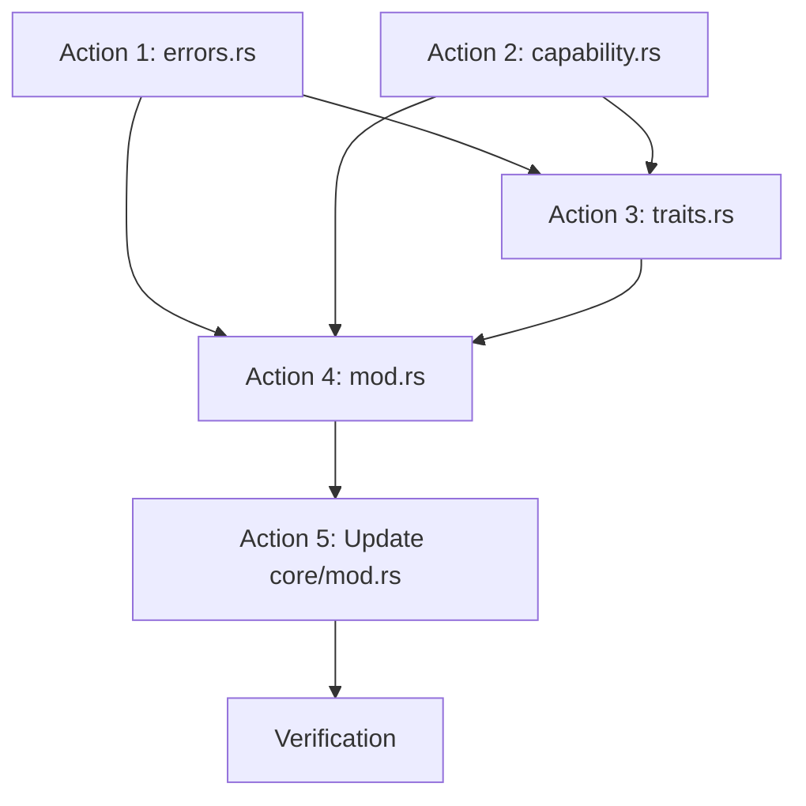

# WASM-TASK-020: Implementation Plans

## Plan References
- **ADR-WASM-028:** Core Module Structure (primary specification, lines 69-73, 395-503, 573-599)
- **ADR-WASM-025:** Clean-Slate Rebuild Architecture
- **ADR-WASM-026:** Implementation Roadmap (Phase 3)
- **KNOWLEDGE-WASM-037:** Rebuild Architecture Clean-Slate

## Target Structure Reference

Per ADR-WASM-028:
```
core/security/
├── mod.rs           # Module declarations and re-exports
├── errors.rs        # SecurityError enum (co-located)
├── capability.rs    # Capability enum and related types
└── traits.rs        # SecurityValidator, SecurityAuditLogger traits + SecurityEvent
```

---

## Implementation Actions

### Action 1: Create `core/security/errors.rs`

**Objective:** Implement `SecurityError` enum with thiserror derive (co-located error pattern)

**File:** `airssys-wasm/src/core/security/errors.rs`

**Status:** Not started

**Specification (ADR-WASM-028 lines 573-599):**

```rust
//! Security error types.

use thiserror::Error;

/// Security-related errors for capability validation and policy enforcement.
#[derive(Debug, Clone, PartialEq, Eq, Error)]
pub enum SecurityError {
    /// Capability was denied for the requested operation.
    #[error("Capability denied: {0}")]
    CapabilityDenied(String),

    /// Security policy was violated.
    #[error("Policy violation: {0}")]
    PolicyViolation(String),

    /// Security context is invalid or missing.
    #[error("Invalid context: {0}")]
    InvalidContext(String),

    /// Permission denied for the requested operation.
    #[error("Permission denied: {0}")]
    PermissionDenied(String),
}
```

**Tests:** 6 unit tests
- Error display formatting tests for each variant
- Clone and PartialEq verification
- Debug formatting test

---

### Action 2: Create `core/security/capability.rs`

**Objective:** Implement all capability types (Capability enum + 4 capability structs + 4 action enums)

**File:** `airssys-wasm/src/core/security/capability.rs`

**Status:** Not started

**Specification (ADR-WASM-028 lines 439-503):**

```rust
//! Capability types for security validation.
//!
//! This module defines the capability-based security model types.
//! Each capability represents a permission to perform specific actions
//! on specific resources.

/// Capability types for security validation.
///
/// # Example
///
/// ```rust
/// use airssys_wasm::core::security::capability::{
///     Capability, MessagingCapability, MessagingAction
/// };
///
/// let cap = Capability::Messaging(MessagingCapability {
///     action: MessagingAction::Send,
///     target_pattern: "org.example/*".to_string(),
/// });
/// ```
#[derive(Debug, Clone)]
pub enum Capability {
    /// Messaging-related capability.
    Messaging(MessagingCapability),
    /// Storage-related capability.
    Storage(StorageCapability),
    /// Filesystem-related capability.
    Filesystem(FilesystemCapability),
    /// Network-related capability.
    Network(NetworkCapability),
}

// --- Messaging ---

/// Messaging capability specification.
#[derive(Debug, Clone)]
pub struct MessagingCapability {
    /// The messaging action permitted.
    pub action: MessagingAction,
    /// Target component pattern (glob-style).
    pub target_pattern: String,
}

/// Messaging action types.
#[derive(Debug, Clone, PartialEq, Eq)]
pub enum MessagingAction {
    /// Send fire-and-forget messages.
    Send,
    /// Send request-response messages.
    Request,
    /// Broadcast to multiple targets.
    Broadcast,
}

// --- Storage ---

/// Storage capability specification.
#[derive(Debug, Clone)]
pub struct StorageCapability {
    /// The storage action permitted.
    pub action: StorageAction,
    /// Namespace pattern (glob-style).
    pub namespace_pattern: String,
}

/// Storage action types.
#[derive(Debug, Clone, PartialEq, Eq)]
pub enum StorageAction {
    /// Read from storage.
    Read,
    /// Write to storage.
    Write,
    /// Delete from storage.
    Delete,
}

// --- Filesystem ---

/// Filesystem capability specification.
#[derive(Debug, Clone)]
pub struct FilesystemCapability {
    /// The filesystem action permitted.
    pub action: FilesystemAction,
    /// Path pattern (glob-style).
    pub path_pattern: String,
}

/// Filesystem action types.
#[derive(Debug, Clone, PartialEq, Eq)]
pub enum FilesystemAction {
    /// Read files.
    Read,
    /// Write files.
    Write,
    /// Delete files.
    Delete,
    /// List directory contents.
    ListDir,
}

// --- Network ---

/// Network capability specification.
#[derive(Debug, Clone)]
pub struct NetworkCapability {
    /// The network action permitted.
    pub action: NetworkAction,
    /// Host pattern (glob-style).
    pub host_pattern: String,
    /// Optional specific port.
    pub port: Option<u16>,
}

/// Network action types.
#[derive(Debug, Clone, PartialEq, Eq)]
pub enum NetworkAction {
    /// Outbound network connections.
    Outbound,
    /// Inbound network connections.
    Inbound,
}
```

**Tests:** 12 unit tests
- Capability enum creation for each variant (4 tests)
- Action enum equality tests (4 tests)
- Struct field access tests (4 tests)

---

### Action 3: Create `core/security/traits.rs`

**Objective:** Implement `SecurityValidator` trait, `SecurityAuditLogger` trait, and `SecurityEvent` struct

**File:** `airssys-wasm/src/core/security/traits.rs`

**Status:** Not started

**Specification (ADR-WASM-028 lines 395-435):**

```rust
//! Security traits for capability validation and audit logging.
//!
//! This module defines the core security abstractions:
//! - [`SecurityValidator`] - Validates component capabilities
//! - [`SecurityAuditLogger`] - Logs security events for audit
//! - [`SecurityEvent`] - Security event data structure

use crate::core::component::id::ComponentId;
use super::capability::Capability;
use super::errors::SecurityError;

/// Trait for validating component capabilities.
///
/// Implemented by the security module, consumed by runtime and messaging modules.
///
/// # Example
///
/// ```rust
/// use airssys_wasm::core::security::traits::SecurityValidator;
/// use airssys_wasm::core::security::capability::{Capability, MessagingCapability, MessagingAction};
/// use airssys_wasm::core::security::errors::SecurityError;
/// use airssys_wasm::core::component::id::ComponentId;
///
/// struct AllowAllValidator;
///
/// impl SecurityValidator for AllowAllValidator {
///     fn validate_capability(
///         &self,
///         _component: &ComponentId,
///         _capability: &Capability,
///     ) -> Result<(), SecurityError> {
///         Ok(()) // Allow all for demo
///     }
///
///     fn can_send_to(
///         &self,
///         _sender: &ComponentId,
///         _target: &ComponentId,
///     ) -> Result<(), SecurityError> {
///         Ok(()) // Allow all for demo
///     }
/// }
/// ```
pub trait SecurityValidator: Send + Sync {
    /// Validate if component has required capability.
    ///
    /// # Arguments
    /// * `component` - The component requesting the capability
    /// * `capability` - The capability being requested
    ///
    /// # Returns
    /// * `Ok(())` if capability is granted
    /// * `Err(SecurityError)` if capability is denied
    fn validate_capability(
        &self,
        component: &ComponentId,
        capability: &Capability,
    ) -> Result<(), SecurityError>;

    /// Check if component can send message to target.
    ///
    /// # Arguments
    /// * `sender` - The sending component
    /// * `target` - The target component
    ///
    /// # Returns
    /// * `Ok(())` if sending is allowed
    /// * `Err(SecurityError)` if sending is denied
    fn can_send_to(
        &self,
        sender: &ComponentId,
        target: &ComponentId,
    ) -> Result<(), SecurityError>;
}

/// Trait for security audit logging.
///
/// Implemented by the audit logging system for security event tracking.
pub trait SecurityAuditLogger: Send + Sync {
    /// Log a security event.
    ///
    /// # Arguments
    /// * `event` - The security event to log
    fn log_event(&self, event: SecurityEvent);
}

/// Security event for audit logging.
///
/// Captures information about security-related actions for audit purposes.
///
/// # Example
///
/// ```rust
/// use airssys_wasm::core::security::traits::SecurityEvent;
/// use airssys_wasm::core::component::id::ComponentId;
///
/// let event = SecurityEvent {
///     component: ComponentId::new("org", "service", "inst-1"),
///     action: "send_message".to_string(),
///     resource: "org.other/target/inst-2".to_string(),
///     granted: true,
///     timestamp_ms: 1700000000000,
/// };
///
/// assert!(event.granted);
/// ```
#[derive(Debug, Clone)]
pub struct SecurityEvent {
    /// The component that performed the action.
    pub component: ComponentId,
    /// The action that was attempted.
    pub action: String,
    /// The resource being accessed.
    pub resource: String,
    /// Whether the action was granted.
    pub granted: bool,
    /// Timestamp in milliseconds since epoch.
    pub timestamp_ms: u64,
}
```

**Tests:** 10 unit tests
- SecurityEvent creation and field access (3 tests)
- Mock SecurityValidator implementation tests (4 tests)
- Mock SecurityAuditLogger implementation tests (2 tests)
- Send + Sync trait bound verification (1 test)

---

### Action 4: Create `core/security/mod.rs`

**Objective:** Module declarations following §4.3 pattern (only declarations, no implementation)

**File:** `airssys-wasm/src/core/security/mod.rs`

**Status:** Not started

**Specification:**

```rust
//! # Security Module
//!
//! Core security abstractions for capability-based security.
//!
//! This module provides the foundation types and traits for the security system:
//! - [`capability`] - Capability types (Messaging, Storage, Filesystem, Network)
//! - [`errors`] - Security error types
//! - [`traits`] - Security validation and audit logging traits
//!
//! # Architecture
//!
//! This is part of **Layer 1** (core/). The security module contains ONLY
//! abstractions and types. Actual security enforcement is implemented in
//! the `security/` module (Layer 2B).
//!
//! # Usage
//!
//! ```rust
//! use airssys_wasm::core::security::capability::{Capability, MessagingCapability, MessagingAction};
//! use airssys_wasm::core::security::errors::SecurityError;
//! use airssys_wasm::core::security::traits::{SecurityValidator, SecurityEvent};
//! ```

// Module declarations (per PROJECTS_STANDARD.md §4.3)
pub mod capability;
pub mod errors;
pub mod traits;

// NOTE: No glob re-exports (pub use X::*) per module grouping policy.
// Callers use namespaced access: core::security::capability::Capability
```

**Tests:** None (mod.rs contains only declarations)

---

### Action 5: Update `core/mod.rs`

**Objective:** Add security submodule declaration and update documentation

**File:** `airssys-wasm/src/core/mod.rs`

**Status:** Not started

**Changes:**
1. Add `pub mod security;` to module declarations
2. Update module documentation to include security submodule
3. Add security usage example to documentation

**Expected Result:**

```rust
//! # Core Module
//!
//! Core data types and abstractions shared by ALL other modules.
//!
//! This module contains foundational types that prevent circular dependencies.
//! Any type that multiple modules need should be defined here.
//!
//! # Submodules
//!
//! - [`component`] - Component-related types (ComponentId, ComponentHandle, ComponentMessage, ComponentLifecycle)
//! - [`messaging`] - Messaging abstractions (MessageRouter, CorrelationTracker, CorrelationId, MessagingError)
//! - [`runtime`] - WASM runtime abstractions (RuntimeEngine, ComponentLoader, ResourceLimits)
//! - [`security`] - Security abstractions (SecurityValidator, Capability, SecurityError)
//!
//! # Architecture
//!
//! This is **Layer 1** of architecture. Core has zero internal dependencies.
//! All other modules (security/, runtime/, component/, messaging/, system/) depend on core/.
//!
//! # Usage
//!
//! ```rust
//! use airssys_wasm::core::component::id::ComponentId;
//! use airssys_wasm::core::component::message::ComponentMessage;
//! use airssys_wasm::core::messaging::correlation::CorrelationId;
//! use airssys_wasm::core::runtime::limits::ResourceLimits;
//! use airssys_wasm::core::security::capability::Capability;
//! ```

// Module declarations (per PROJECTS_STANDARD.md §4.3)
pub mod component;
pub mod messaging;
pub mod runtime;
pub mod security;

// NOTE: No glob re-exports (pub use X::*) per module grouping policy.
// Callers use namespaced access: core::component::id::ComponentId
```

---

## Verification Commands

```bash
# 1. Build check
cargo build -p airssys-wasm

# 2. Lint check
cargo clippy -p airssys-wasm --all-targets -- -D warnings

# 3. Run all tests
cargo test -p airssys-wasm --lib

# 4. Run security module tests only
cargo test -p airssys-wasm --lib security

# 5. Verify internal imports only (no external crate:: imports)
grep -rn "use crate::" src/core/security/
# Should only show core/ internal imports (core::component)

# 6. Verify module boundary compliance
grep -rn "use super::" src/core/security/
# Should show internal module imports only
```

---

## Success Criteria

- [ ] All types from ADR-WASM-028 implemented exactly as specified
- [ ] Build passes with zero warnings
- [ ] Clippy passes with zero warnings
- [ ] All unit tests pass (expected: ~28 tests in security module)
- [ ] Proper dependency on core/component/ types (ComponentId)
- [ ] No forbidden imports (only std, thiserror, and core/ siblings)
- [ ] All public types implement Debug trait
- [ ] All traits have Send + Sync bounds
- [ ] mod.rs files contain only declarations (§4.3 compliance)
- [ ] Comprehensive rustdoc with examples on all public items

---

## Execution Order



**Recommended execution sequence:**
1. Create `errors.rs` (no dependencies)
2. Create `capability.rs` (no dependencies)
3. Create `traits.rs` (imports from errors.rs and capability.rs)
4. Create `mod.rs` (declares all submodules)
5. Update `core/mod.rs` (adds security module)
6. Run verification commands

---

## Standards Compliance Checklist

- [ ] **§2.1 3-Layer Import Organization** - Only std, thiserror, and core/ imports
- [ ] **§2.2 No FQN in Type Annotations** - Use imported type names
- [ ] **§4.3 Module Architecture Patterns** - mod.rs only declarations
- [ ] **§6.1 YAGNI Principles** - Only implement what's in ADR-WASM-028
- [ ] **§6.2 Avoid `dyn` Patterns** - Use trait bounds where applicable
- [ ] **§6.4 Quality Gates** - Zero warnings, comprehensive tests
- [ ] **M-MODULE-DOCS** - All modules have rustdoc
- [ ] **M-PUBLIC-DEBUG** - All public types implement Debug
- [ ] **M-ERRORS-CANONICAL-STRUCTS** - Use thiserror for errors
