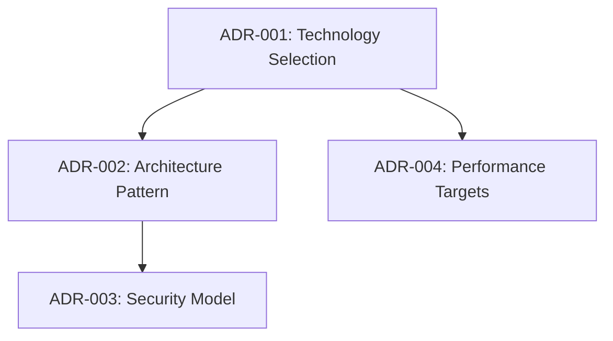

# Architecture Decision Records Index Template

**Sub-Project:** [sub_project_name]  
**Last Updated:** [YYYY-MM-DD]  
**Total ADRs:** [count]  
**Active ADRs:** [count]  

## ADR Summary

### By Status
| Status | Count | Description |
|--------|-------|-------------|
| Proposed | [count] | Decisions under consideration |
| Accepted | [count] | Active architectural decisions |
| Deprecated | [count] | Decisions no longer applicable |
| Superseded | [count] | Decisions replaced by newer ones |

### By Category
| Category | Count | Description |
|----------|-------|-------------|
| Technology Selection | [count] | Framework, library, and tool choices |
| Architecture Patterns | [count] | System design and structural decisions |
| Security | [count] | Security model and implementation decisions |
| Performance | [count] | Performance optimization and target decisions |
| Integration | [count] | External system integration approaches |
| Data Management | [count] | Data storage and processing decisions |

## Chronological ADR Registry

### 2025
| ADR | Status | Date | Title | Impact | Related |
|-----|--------|------|-------|--------|---------|
| [ADR-001] | Accepted | 2025-09-27 | [Decision title] | [High/Medium/Low] | [Links] |
| [ADR-002] | Proposed | 2025-09-28 | [Decision title] | [High/Medium/Low] | [Links] |

### 2026 (Planned)
| ADR | Status | Date | Title | Impact | Related |
|-----|--------|------|-------|--------|---------|
| [ADR-003] | Proposed | 2026-Q1 | [Future decision title] | [High/Medium/Low] | [Links] |

## Active Decisions by Category

### Technology Selections
| ADR | Title | Status | Date | Technologies | Impact |
|-----|-------|--------|------|--------------|--------|
| [ADR-001] | [Technology decision] | Accepted | [YYYY-MM-DD] | [Tech list] | [Impact level] |

### Architecture Patterns
| ADR | Title | Status | Date | Patterns | Impact |
|-----|-------|--------|------|----------|--------|
| [ADR-002] | [Architecture decision] | Accepted | [YYYY-MM-DD] | [Pattern list] | [Impact level] |

### Security Decisions
| ADR | Title | Status | Date | Security Model | Impact |
|-----|-------|--------|------|----------------|--------|
| [ADR-003] | [Security decision] | Accepted | [YYYY-MM-DD] | [Security approach] | [Impact level] |

### Performance Decisions
| ADR | Title | Status | Date | Performance Target | Impact |
|-----|-------|--------|------|-------------------|--------|
| [ADR-004] | [Performance decision] | Accepted | [YYYY-MM-DD] | [Target metrics] | [Impact level] |

## Decision Dependencies

### Decision Chains

### Blocked Decisions
| ADR | Title | Blocked By | Blocking Reason | Target Resolution |
|-----|-------|------------|-----------------|-------------------|
| [ADR-XXX] | [Decision title] | [ADR-YYY] | [Reason] | [Date] |

## Decision Impact Analysis

### High Impact Decisions
- **[ADR-001]**: [Brief description of impact]
- **[ADR-002]**: [Brief description of impact]

### Cross-Component Dependencies
| ADR | This Component | Affects Components | Impact Description |
|-----|----------------|-------------------|-------------------|
| [ADR-001] | airssys-osl | airssys-rt, airssys-wasm | [Impact description] |

### Workspace Standards Impact
| ADR | Standards Affected | Compliance Impact | Action Required |
|-----|-------------------|-------------------|-----------------|
| [ADR-001] | §2.1, §3.2 | [Positive/Negative/Neutral] | [Action needed] |

## Recent Changes

### Last 30 Days
| Date | ADR | Change | Description |
|------|-----|--------|-------------|
| [YYYY-MM-DD] | [ADR-001] | Status Change | Moved from Proposed to Accepted |
| [YYYY-MM-DD] | [ADR-002] | Created | New decision for [topic] |

### Upcoming Reviews
| ADR | Review Date | Review Type | Assigned To |
|-----|-------------|-------------|-------------|
| [ADR-001] | [YYYY-MM-DD] | Effectiveness Review | [Name] |
| [ADR-002] | [YYYY-MM-DD] | Implementation Review | [Name] |

## Cross-References

### Related Technical Debt
| ADR | Related Debt | Relationship |
|-----|--------------|-------------|
| [ADR-001] | [DEBT-001] | Decision created debt |
| [ADR-002] | [DEBT-002] | Decision resolves debt |

### Related Knowledge Docs
| ADR | Knowledge Doc | Relationship |
|-----|---------------|-------------|
| [ADR-001] | [KNOWLEDGE-arch-module] | Implementation details |
| [ADR-002] | [KNOWLEDGE-perf-optimization] | Performance implications |

### Related Tasks
| ADR | Task | Relationship |
|-----|------|-------------|
| [ADR-001] | [task_001] | Implementation task |
| [ADR-002] | [task_002] | Evaluation task |

## Maintenance

### Review Schedule
- **Monthly:** Status review and impact assessment
- **Quarterly:** Decision effectiveness evaluation
- **Annually:** Strategic architectural review

### Update Triggers
- New ADR creation
- Status changes (Proposed → Accepted, etc.)
- Implementation completion
- Decision supersession or deprecation

### Quality Metrics
- **Decision Implementation Rate:** [X]% of accepted decisions implemented
- **Decision Effectiveness:** [Y]% of decisions achieving intended outcomes
- **Decision Stability:** [Z]% of decisions remain unchanged after 6 months

### Index Maintenance
- **Owner:** [Name/Role]
- **Backup:** [Name/Role]
- **Next Review:** [YYYY-MM-DD]

---
**Template Version:** 1.0  
**Last Updated:** 2025-09-27