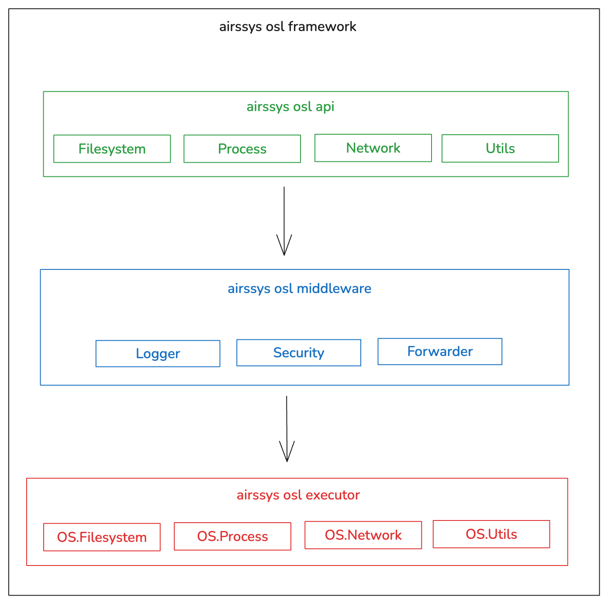

# airssys-osl (OS Abstraction Layer)

This component will handle all low-level OS system programming, enhanced with activity logs and robust security policies

This component will handle these important and common system activities:
- Filesystem management
- Process management
- Network management
- Utils management
    - Something like calling other programs such as: `docker`, or `gh (github cli)`

## Motivation

The reason why I think I need this component is inspired by `airs-mcpserver-fs` project. This MCP tool provides access for an AI model so they can access the OS local environment to manipulate some filesystem (i/o), such as reading or writing a file. This MCP tool actually already provides a good enough security validator that tries to prevent any harmful activities, including avoiding any access to binary files, through its custom configurations.

I'm thinking of continuing to create other MCP tools that may need direct access to OS environments, such as running or stopping Docker, but I think I need more robust security, and also for its low-level system programming management. Actually, I can just use direct OS `Command` or `std::fs` from `Rust`, but I'm thinking to provides more controllable environments, such as:

- Monitoring commands, processes or activities
- More robust security policies, like `ACL` or `RBAC`

Based on these needs, I'm thinking of providing a high-level `OS Abstraction Layer (OSL)` that try to abstracting all of possible solutions and also provides `OS Middleware Layer`:

- Activity logs
- Robust security framework

## Architecture



### Building Blocks

#### Airssys OSL API

Provides high-level API methods or functions used by the caller to access OS activities, such as creating a new file or executing some OS processes

#### Airssys OSL Middleware

The `Middleware` component is a layer in the middle of the process between high-level APIs and their low-level OS executor. Our `OSL Framework` will pass through all requested activities to all available middleware , if there is an error on some middleware's processes, it will stop the request and throw the error.

Provides default three middlewares:

- `Logger`
- `Security`

Before each of the requested actions/activities is executed, it must go through this layer to log the activity and check for the security allowances. If it passed security check successfully, it will be forwarding to the *executor*

#### Airssys OSL Executor

Once a request passes security validations and has already been registered as a new `Runtime Process`, it will be *forwarded* to its specific executor based on activity or action type. On this layer, it will execute directly to the OS low-level executor through specific Rust OS executors. 

The main purpose of the executor must be modular, meaning that we can customize executors in the future, such as:

- Filesystem Executor
- Process Executor
- Network Executor
- Utils Executor

And all of those executors must implement the same `Executor` trait, so the `OSL Framework` can call them in the same way.

## Quick Start

Add `airssys-osl` to your `Cargo.toml`:

```toml
[dependencies]
airssys-osl = { version = "0.1", features = ["macros"] }
```

### Basic Usage with Helper Functions

The easiest way to use `airssys-osl` is through helper functions:

```rust
use airssys_osl::helpers::*;

#[tokio::main]
async fn main() -> Result<(), airssys_osl::core::result::OSError> {
    // Read a file - simple API with security context
    let content = read_file("/tmp/test.txt", "my-user").await?;
    println!("Read {} bytes", content.len());
    
    // Write to a file
    write_file("/tmp/output.txt", b"Hello, World!".to_vec(), "my-user").await?;
    
    // Spawn a process
    let output = spawn_process("ls", vec!["-la".to_string()], "my-user").await?;
    println!("Process output: {}", String::from_utf8_lossy(&output));
    
    // Connect to network
    network_connect("127.0.0.1:8080", "my-user").await?;
    
    Ok(())
}
```

### Advanced Usage with Direct Executors

For more control, you can use executors directly:

```rust
use airssys_osl::prelude::*;

#[tokio::main]
async fn main() -> Result<(), OSError> {
    // Create operation and context
    let operation = FileReadOperation::new("/tmp/test.txt".into());
    let context = ExecutionContext::default();
    
    // Execute with executor
    let executor = FilesystemExecutor::default();
    let result = executor.execute(operation, context).await?;
    
    println!("Read {} bytes", result.output.len());
    Ok(())
}
```

### Using Middleware with Extension Trait

Add middleware capabilities to any executor using the extension trait:

```rust
use airssys_osl::prelude::*;

#[tokio::main]
async fn main() -> Result<(), OSError> {
    // Create executor with logging middleware
    let logger = ConsoleActivityLogger::default();
    let middleware = LoggerMiddleware::new(logger);
    
    let executor = FilesystemExecutor::default()
        .with_middleware(middleware);
    
    // Execute operation - automatically logs activity
    let operation = FileReadOperation::new("/tmp/test.txt".into());
    let context = ExecutionContext::default();
    let result = executor.execute(operation, context).await?;
    
    Ok(())
}
```

### Creating Custom Executors with Macros

The `#[executor]` macro simplifies creating custom executors by generating boilerplate code:

```rust
use airssys_osl::prelude::*;

#[executor(operations = [Filesystem])]
struct MyCustomExecutor;

impl MyCustomExecutor {
    async fn execute_file_read(
        &self,
        operation: FileReadOperation,
        _context: ExecutionContext,
    ) -> Result<ExecutionResult, OSError> {
        println!("Reading file: {}", operation.path());
        
        // Custom implementation
        Ok(ExecutionResult::success(vec![]))
    }
    
    async fn execute_file_write(
        &self,
        operation: FileWriteOperation,
        _context: ExecutionContext,
    ) -> Result<ExecutionResult, OSError> {
        println!("Writing {} bytes to: {}", operation.content().len(), operation.path());
        
        // Custom implementation
        Ok(ExecutionResult::success(vec![]))
    }
}
```

For more details, see:
- [Helper Functions Guide](docs/src/guides/helper-functions.md)
- [Middleware Guide](docs/src/guides/middleware.md)
- [Custom Executor Guide](docs/src/guides/custom-executors.md)
- [Macros API Reference](docs/src/api/macros.md)
- [Examples](examples/)

## Features

### Core Features
- **Cross-platform OS abstraction** - Unified interface for filesystem, process, and network operations
- **Type-safe operations** - Strongly-typed operation definitions with compile-time guarantees
- **Async/await support** - Built on Tokio for efficient async operations
- **Middleware pipeline** - Extensible middleware for logging, security, and custom logic
- **Security framework** - Built-in security policies and validation

### Optional Features
- `macros` - Procedural macros for simplified custom executor development

## Examples

The `examples/` directory contains comprehensive examples:

- `basic_usage.rs` - Basic operation execution
- `middleware_pipeline.rs` - Custom middleware creation
- `logger_comprehensive.rs` - Advanced logging configuration
- `custom_executor_with_macro.rs` - Creating custom executors with macros

Run examples with:

```bash
cargo run --example custom_executor_with_macro --features macros
```

## Documentation

Full documentation is available in the `docs/` directory and can be built with mdBook:

```bash
# Install mdBook (one-time)
cargo install mdbook

# Serve documentation locally
mdbook serve airssys-osl/docs

# Build documentation
mdbook build airssys-osl/docs
```

## Development

### Running Tests

```bash
# Run all tests
cargo test --workspace

# Run OSL tests only
cargo test --package airssys-osl

# Run with features
cargo test --features macros
```

### Code Quality

```bash
# Check code
cargo check --workspace

# Run clippy
cargo clippy --workspace --all-targets --all-features

# Format code
cargo fmt --all
```

## License

Licensed under either of:

- Apache License, Version 2.0 ([LICENSE-APACHE](../LICENSE-APACHE))
- MIT License ([LICENSE-MIT](../LICENSE-MIT))

at your option.